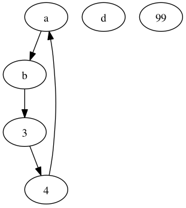

# Grammar Construction Lab

## Goal

In order to implement languages, is critical that you understand how to build grammars. In particular, it's important that you learn how to read a description or a set of exemplars and create a grammar that represents that structure. In this lab, you will try to build grammars for a few simple languages.

Use ANTLR notation and, if you want, use intellij for its ANTLR plugin. Unless otherwise specified, consider only about the grammatical level, not the lexical level. So, for all integers, you can use token reference `INT`. Order your grammatical rules so that the first rule the grammar is start symbol.

## Language tasks

### LISP

In LISP ("Lists of superfluous parentheses"), programs are really just function evaluations but instead of `f(x)`, we see `(f x)`. Write a grammar for a subset of LISP that properly generates these sentences:

```
( )
34
x
(f x)
(f x y z)
(f ())
(f (g x) y)
```

### Graphs

Write a grammar to match a graph description, which is just a list of nodes and and edges. For example,

```
a -> b
b -> 3
3 -> 4
4 -> a
d
99
```

represents the following graph:



### XML tags

XML tags can be very complicated and where you draw the line between the parser and the lexer depends on your application. For this task, you are to match entire tags within the lexer.  You also have to collect all of the text in between tags as a token called `TEXT`, which will include whitespace. That means you will have only two tokens emitted from the lexer. You also need a token that gets thrown out for comments (`skip`ped). Here's some sample input:

```xml
<!-- sample comment
-->
<cars>
	<car brand="bmw" id=BMW>expensive but nice</car>
	<car brand="fiat" price=99.0>um, not great
</car>
</cars>
```

### Expressions

Write an unambiguous grammar for expressions with the following operators: `*`, `/`, `+`, `==` with the usual precedence. For primary expression elements, allow identifiers, integers, and parenthesized expressions. Hint: there will be a rule for each level of precedence and a rule for primaries.

```java
33
x
x+y*z
(x+y)/z
x == 3+(z)/9
```