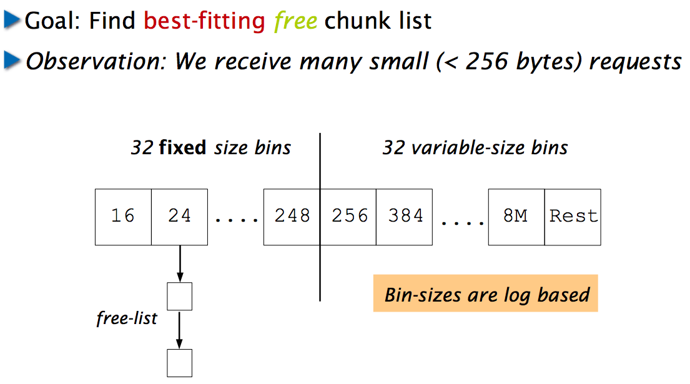

# Memory allocation, manual reclamation

Let's say we want to implement C library functions for allocation and manual reclamation of dynamic memory:
 
```c
void* malloc(size_t size);
void free(void* ptr);
```

There are two fundamental strategies: *sequential* and *free-list allocation*.

## "Gift" allocator

What's the simplest way to implement? `malloc` just gets more memory from the operating system and `free` is a no-op. hahaha. Oddly enough this works for many short-lived applications; in fact, most applications probably have memory leaks because they forget to call `free` so in fact they might be using this methodology without knowing it.

This uses a sequential allocation strategy because it just gives away more memory at the so-called high watermark. This is sometimes called bump pointer allocation.

Bump pointer allocation is extremely efficient for allocating memory.

## "Loan" allocators (we want it back)

Allocators often use a *free list* which we can think of as just a linked list of free chunks of memory within the heap. (Technically the free list is a set not perforce a list.) The list could be external to the heap or threaded within the object to the heap itself. In fact it doesn't have to even be a list. [Doug Lea's malloc](http://g.oswego.edu/dl/html/malloc.html) uses size information at the start and end of every allocated or free block. (He calls them *boundary tags*.) Traversing the list is a matter of hopping over chunks rather than directly jumping to a pointer. It also means we can easily coalesce neighboring free chunks into a single larger free chunk.


### Binning

[Lea's malloc]() uses bins whereby "*available chunks are maintained in bins, grouped by size. Bins for sizes less than 512 bytes each hold only exactly one size. Searches for available chunks are processed in smallest-first, best-fit order.*"


The space within free chunks has pointers that form a linked list within a bin of the appropriate size. This indicates there is a minimum size for any allocated chunk but it's no big deal. 

See [lecture 12 from Harvard CS61: Systems Programming and Machine Organization](http://www.eecs.harvard.edu/~mdw/course/cs61/mediawiki/images/5/51/Malloc3.pdf) for more details; e.g.,



For the bins that do not have exact sizes, above 512, you can sort the elements within the bin for faster searching.

### Bitmaps

Instead of a free list, allocators can use a bitmap. From "*Mark without much Sweep Algorithm for Garbage Collection*" by Danko Basch, Dorian Ivancic, Nikica Hlupic:

<blockquote>
Allocators may use bitmaps where each bit is mapped to several bytes in the heap. Each bit denotes whether its associated bytes are free or used. On allocation request the allocator scans the bitmaps in search for sufficiently long sequence of zeroes. To free the block, all its related bits should be cleared so the block size has to be known.
</blockquote>

From (I think) *Tanenbaum & Woodhull, Operating Systems: Design and Implementation, (c) 2006*:


## Comparison

It is my understanding that bitmaps require more memory than linked lists but that bitmaps might be faster for deallocation because they can just set some bits rather than having to coalesce adjacent free regions and so on. On the other hand, the free list should be faster for allocation, particularly with binning.

## Allocation strategies

Paraphrasing [Memory Allocation from University of Illinois](https://courses.engr.illinois.edu/cs241/sp2011/lectures/21-MemoryAlloc.pdf). Find a chunk of memory big enough to hold the requested size and save any left over for a future allocation. 

The goals are speed of allocation, deallocation, and reduced *fragmentation*. It's possible to have plenty of space available to service an allocation size but not in a single contiguous chunk.

1. First fit. Creates average size holes.
2. Best fit; exact size or smallest chunk that works. Smallest left over holes but creates lots of small holes that can't really be used.
3. Worse fit; use largest available chunk. Produces the largest left over holes but can't run large programs.

To reduce fragmentation, we can perform compaction but it means updating all of the pointers within the fields of objects allocated already in the heap as well as altering a pointers from the program into the heap. Or, we could use a [handles](http://www.brpreiss.com/books/opus5/html/page429.html) mechanism whereby all pointers are assumed to be pointers to pointers. We can update an objects location without having to change any of the "pointers" to that object.