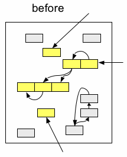
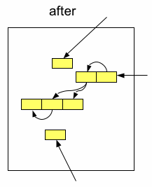
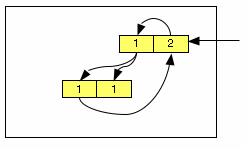
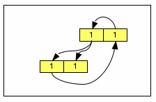
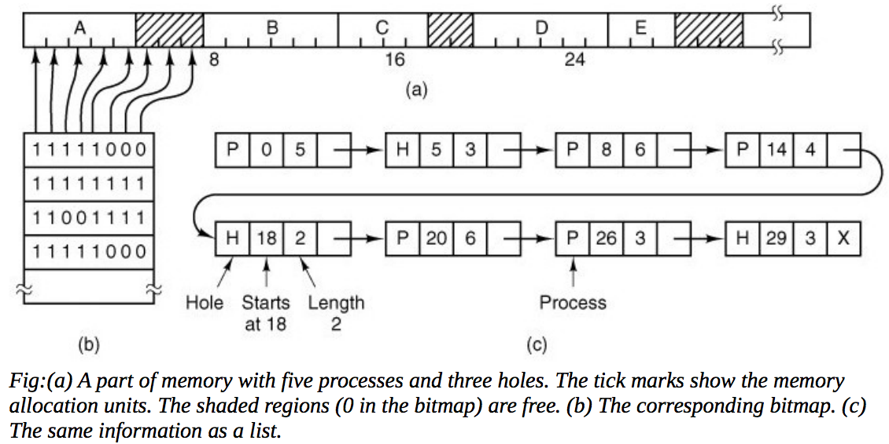

# Memory allocation and garbage collection

## Introduction

For much of my career (prior to 1995 when Java appeared on the scene), debugging software was all about answering a frustrating, but critical question: "is there a problem with my algorithm or have I corrupted memory and, hence, the runtime system?" I have traced problems down to memory allocation / deallocation issues many many times. I used to build special memory.h that left magic numbers before/after objects etc...

Fortunately, software can help us write software. Just as we use IDEs and debuggers to make us more efficient, we can use automatic garbage collection (GC) to avoid dynamic memory programming errors and increase productivity dramatically. You are not good at tracking garbage manually and programmers typically do lots of extra copying to resolve "who frees what" issues between programmers.

Simply put, GC relieves the programmer from having to track and deallocate dynamic memory--you do not have to write code to deallocate data structures. GC reduces cognitive load. People estimate about 10% of CPU time for automatically collecting garbage. An excellent trade.


### The basic idea and terms

The core GC strategy is:

1. At some frequency, distinguish live from dead objects (tracing) and reclaim dead ones.
1. Live objects are reachable from roots, which are globals, locals, registers of active methods etc...

**Analogy**: Imagine walking to the refrigerator and getting out a bowl of grapes. You pick up the bunch by the stem and look in the bottom of the bowl; there are a bunch of black and blue moldy grapes--that's the "garbage". Anything not reachable from the stem has gone "bad." (This analogy is attributed to Randy Nelson, now at Pixar, formerly of the Flying Karamazov Brothers).

Imagine a heap of dynamic memory for a running program. Certain variables point into the heap to your data structures. When those variables no longer point at a data structure, nothing can reach the data structure so it's garbage:



After garbage collecting, you'd see something like this:



GC often implicitly assumes that the objects in memory are typed so you know how to find the pointers within, say, an AST node. This does not mean that GC only works in interpreters--compiled languages such as C++ can store runtime type information now.

Further, w/o type information you can still do *conservative collection*. If it looks like a pointer, assume it is. That unfortunately leaves some objects around because you still (erroneously) think you have a pointer to those objects (in fact they are probably just integers). Java has lots of type information in the objects as well as the bytecodes that operate on data, hence, does not have to be conservative in general. Conservative is bad in my opinion since "conversative GC implies leaking memory".

[Important terms defined](http://www.iecc.com/gclist/GC-algorithms.html)

## Common Strategies

There are two main user-perspective categories of GC: *disruptive* and *nondisruptive* (often called *pauseless*). I can remember LISP programs halting in the middle and saying "Sorry...garbage collecting...". Ack! A disruptive GC is one that noticeably halts your program and usually means it's doing a full collection of a memory space and literally turning off your program for a bit. If you interleave little bits of collection alongside the running program, you call it an incremental collector; if it runs at the same times as the program, you call it a *concurrent* collector. These collectors are a lot harder to implement because you must deal with the program altering data structures while the collector sniffs the structures. If you are building a real-time system, however, incremental collectors are pretty much a requirement.

### Reference Counting

This simplest GC strategy is [reference counting](http://www.brpreiss.com/books/opus5/html/page421.html), which adds a counter for every "object" in your system. When you copy a reference to that object, you increment the count by one. When a reference to an object goes away (such as when a local variable goes out of scope), the count is decremented by one. If, at that time, the count goes to 0, the object is garbage and all pointers emanating from it should be decremented. Then that object is reclaimed (as are any other objects that go to 0 during the count update phase).

Reference counting is mostly nondisruptive, but can't handle cycles. A cycle looks like this:



and then after you dereference the object and decrement its count, it is still greater than 0 because an object inside the heap refers to it. These objects are no longer reachable from a root and will never be reclaimed.



Cycles occur often enough: as in circular queues, doubly-linked trees etc...

The cost is also high as it is proportional to the amount of work done in program.

### Disruptive, Stop-And-Collect Schemes

#### Mark and sweep

[Mark and sweep](http://www.brpreiss.com/books/opus5/html/page424.html) collectors are two-phase collectors that first walk the live objects, marking them, and then finds all the dead objects (i.e., anything that is not live). This is pretty easy to understand and build but badly fragments memory, wastes time walking dead objects (assuming you don't have to run destructors), and has bad virtual memory characteristics.

**Marking**.  To mark an object, we either have to add a mark a bit to each object's header or keep a separate table that maps objects to a mark bit. The latter is preferable for efficiency reasons of the collector itself and it does not require alterations to the objects. This could be important with uncooperative languages like C or C++ where we cannot intrude on their layouts. Each bit in a bitmap denotes the possible starting locations for objects.

[Slava Pestov](http://factor-language.blogspot.com/2009/11/mark-compact-garbage-collection-for.html) ([his code in Factor language project](http://gitweb.factorcode.org/gitweb.cgi?p=factor-master/.git;a=tree)) has a good discussion of how allocation bitmaps work and their use with mark/sweep. We use use a bit table that refers to objects in the heap. To free objects, we can look for unmarked regions in the bit table and add the combined chunk to the freelist. Or, use a bitmap allocator that looks for free chunks by scanning the bitmap. Each bit represents a chunk of memory (16 bytes ish) in the heap, not an object. To mark an object, we mark every bit in the bitmap corresponding to addresses occupied by that object. From (I think) *Tanenbaum & Woodhull, Operating Systems: Design and Implementation, (c) 2006*:



**Sweeping**.  After marking, our bitmap knows exactly which regions of the heap are still reachable. Slava describes the sweep steps:

1. Reset the free list (the list of free regions available in the heap for use by the program)
2. Walk the mark bitmap and add a chunk to the free list for all contiguous ranges of off bits. This is much faster than walking the garbage calling free on everything, which would be necessary if mark bits were in the object headers.

#### Mark and compact

An improvement on this strategy is called [mark and compact](http://www.brpreiss.com/books/opus5/html/page428.html) because it walks memory moving all live objects to the front of the heap, thus, leaving a nice big contiguous block of free memory afterwards. This removes fragmentation concerns and helps locality for cache / virtual memory because objects are kept in same order in which they were allocated. We still have to walk the memory a lot and you have to update pointers since you are moving things around. We don't have to walk the dead objects to free them in this strategy. We simply pack all live objects at the start of the heap, which effectively overwrites all of the dead stuff. We do have to walk the objects in sorted address order to shift all objects "down" in the heap to compact. That implies we need to sort and that we need an object list, at least temporarily during collection. Object allocation is a simple pointer bump. The compact operation is fairly complicated and typically uses 3 passes and requires (in one mechanism) an extra forwarding_addr field in each object:

1. Walk live objects, collecting forwarding addresses.  As usual, memory allocation is as simple as bumping a pointer in the heap. As we wander through the live objects, an object's new address is the next free spot.
1. Replace pointers (roots and pointer fields of objects) with new forwarding address
1. Do the actual move of objects to their new location.

If we keep the forwarding address inside the objects themselves, we need 3 passes. More specifically, we need to keep 2 and 3 separate. We cannot move objects until all pointers have been updated.

By computing all new addresses and holding them in an area outside of the heap, with the marked bits, we can reduce the number of passes to two. We can move objects and set pointers at the same time. (Collapsing steps 2 and 3 above).

If we don't keep forwarding addresses within the objects themselves, we need a map from old to new addresses, which can be expensive in space and time if we're not careful. [Slava Pestov](http://factor-language.blogspot.com/2009/11/mark-compact-garbage-collection-for.html) explains:

<blockquote>
It is easy to see that the final destination of every block can be determined from the number of set bits in the mark bitmap that precede it. (TJP: the sum of on bits says how much memory is needed for objects before you in the heap.)

Since the forwarding map is consulted frequently -- once for every pointer in every object that is live during compaction -- it is important that lookups are as fast as possible. The forwarding map should also be space-efficient. This completely rules out using a hashtable (with many small objects in the heap, it would grow to be almost as big as the heap itself) or simply scanning the bitmap and counting bits every time (since now compaction will become an O(n^2) algorithm). The correct solution is very simple, and well-known in language implementation circles, but I wasn't aware of it until I studied the Clozure Common Lisp garbage collector. You count the bits set in every group of 32 (or 64) bits in the mark bitmap, building an array of cumulative sums as you go. Then, to count the number of bits that are set up to a given element, you look up the pre-computed population count for the nearest 32 (or 64) bit boundary, and manually compute the population count for the rest. This gives you a forwarding map with O(1) lookup time. This algorithm relies on a fast population count algorithm; I used the standard CPU-independent technique in the popcount() function of bitwise_hacks.hpp.
</blockquote>

I believe that we always need to compute all forwarding addresses first. If we tried to move objects without looking at all objects, we might clobber alive object. Imagine a live object sitting at the first memory location in the heap and imagine that we visit it last. At least one object would be stepping on top of it.

#### Scavenging (copying) collectors

If instead of moving live objects to the head of a single heap, you copy live objects to another memory space, you have a copying collector. You only have to walk the live objects (updating their pointers as you move them)--anything left in the old space is garbage. The term *scavenging* is often used to refer to this process. This has the advantages of the mark and compact algorithm but is easier to implement. We can simply recursively move objects and update pointers as we traverse live objects. The cost is that we can only use up to half the memory available because we have two spaces.

Copying collectors have a lot of work to do moving objects at each collection!

A super awesome mechanism for walking the live objects is called *Cheney scanning*, but requires that we can identify any pointers within an object. The algorithm first copies all objects pointed to by roots to the target space. This set then consists of all pointers we might need to walk and, since the objects are consecutive in memory, we don't need a linked list or separate array to track them. We can simply hop from object object in the target space looking for pointers back into the source space. As with other copying schemes, we have to track forwarding addresses.

Note that if you have a finalize() method (a destructor), it implies you have to walk garbage even if not strictly required by your strategy.

Allocation for any copying collector is fast because you just have to bump a pointer in the heap; all free memory is contiguous after collection.

### Details

A scavenging collector operates on two equally sized heaps, heap0 and heap1. We ping-pong between heaps by swapping heap0 and heap1 pointers. That way we can always be scavenging from heap0 to heap1. 

At each collection, all live objects are scavenged from one space and copied to the start of the second space. The roots are updated and we flip from one heap to the other. Scavenging leaves the current heap, heap0, completely empty.  New allocations (after collection) are done in target heap at the address beyond all of the objects that we copied from heap0. In other words, if we scavenge 1000 bytes from heap0, new allocations in heap1 occur at address 1000. Because we swap heap0 and heap1 at the end of collection, however, new allocations (by the user program) always occur in heap0.

We have:

```C
static void *heap0;
static void *heap1;
```

in addition to the pointers we use in mark and compact:

```C
static void *start_of_heap;
static void *end_of_heap;
static void *next_free;
static void *next_free_forwarding;
```

`end_of_heap` can be easily computed on demand. `next_free` and `next_free_forwarding` operate in `heap0` and `heap1`, respectively.

Scavenging uses a bump pointer allocator.

Scavenging does not require a mark bit field or a forwarding address field in live objects. However, we do need a forwarding address field in zombie objects. A zombie object is one that has been copied into the new space but before the end of the collection process. Zombies hang around for the sole purpose of updating pointers from other objects (and roots) to the forwarding address in heap1. For our purposes, perhaps it's best to just force every object to have a forwarding address field.

The algorithm can be done recursively, and all in one function, without additional data structures. It is in some ways simpler than the market and compact, at the cost of twice as much memory.

```C
heap_object **_roots[MAX_ROOTS];
For each root {
	*_roots[i] = _forward(*_roots[i]);
}
```

```C
heap_object *forward(heap_object *p) {
    // first check to see if we have already processed this object
    if p address in target heap1, return p; // p points to real obj in heap1
    if p->forwarded, return p->forwarded;   // p is a zombie in heap0, real in heap1
    p' = next_free_forwarding + p->size;    // bump allocate in heap1
    p->forwarded = p';                      // zombie knows real location
    for each pointer field f of p {
        f = forward(f);         // move objects reachable from the old
    }                           // and update pointer field
    return p';                  // return new location in heap1
}
```

### Nondisruptive, Generational Schemes

The disruptive stop-and-collect schemes are so disruptive because they have so much work to do--they must deal with the entire heap. If your heap is 3G, then it has lots to do.

Observation: most objects live only a short time while some tend to live a long time (think about System object in Java).

A *generational collector* takes advantage of this observation by having a "younger" and an "older" generation. Objects that live a few "generations" (i.e., collection runs), are moved to the "older" generation, which reduces the amount of live objects the collector must traverse in the younger generation.

[Myths and Realities: The Performance Impact of Garbage Collection](http://www.cs.utexas.edu/users/mckinley/papers/mmtk-sigmetrics-2004.pdf): "*Our experiments show that the generational collectors provide better performance than the whole heap collectors in virtually all circumstances*."

Note the similarity to the mark and copy algorithm; here, though, the "when to copy" algorithm is very different. A generational copying collector moves objects to another generation when it has survived a few generations. Mark and copy copies all live objects upon each activation, thus, not significantly reducing its workload for future generations. Also, there may be many generations, not just two spaces as in a mark and copy scheme.

Generational collectors have more bookkeeping to do than the mark and compact or marketing copy collectors. They have track references that spanned generations. In general, all or most pointers will point intra-nursery or into older generations and not point from older generations into the nursery. Hopefully that means our overhead is not too bad.

We want to reduce how many live objects we have to look at to determine what is alive and what is dead and so we want to trace only the objects in the nursery. But, we might find that there are objects pointed to from the older generation but not from the nursery itself. We can't declare those objects as dead.  That means we need a way to find pointers into the nursery from the older generation without having to walk all live objects in the older generation.  We can create pointers from the old into the nursery when we move objects to the older generation and the mutator itself can alter pointers. If you track memory writes to identify pointers that point into the nursery. These are oddly called *write barriers*.  A write barrier is literally some code generated by the compiler upon each pointer store. In both cases, the *remembered set* records the address of pointers that contain intergenerational pointers of interest.  This effectively increases the size of the root set for doing the minor collection in the nursery. See [Slava Pestov's write barrier discussion](http://factor-language.blogspot.com/2009/10/improved-write-barriers-in-factors.html).

See [Myths and Realities: The Performance Impact of Garbage Collection](http://www.cs.utexas.edu/users/mckinley/papers/mmtk-sigmetrics-2004.pdf):

<blockquote>
We carefully measure the impact of the write barrier on the
mutator and find that their mutator cost is usually very low (often
2% or less), and even when high (14%), the cost is outweighed by
the improvements in collection time.
</blockquote>

In the end, even generational schemes must stop-and-collect the older generations. Hopefully this can be hidden from the user such as when the system is waiting for user input. Java does this by making the collector the lowest priority thread. When nothing else is running, the collector starts up (and hopefully finishes).

### Nondisruptive, Incremental Tracing Collectors

If you must avoid stopping to do collection, you can interleave collection with the running program, stopping the program during tiny collections, with an *incremental collector*. *Concurrent collectors* also interleave their work with the execution of the *mutator* (the program) but does not stop the execution of the mutator. It presents an obvious concurrency problem because, while it's looking for (tracing) live objects, the mutator can rearrange the objects.

One means of dealing with this concurrency is a *write barrier*, which tracks pointer writes. The write barrier can record writes of pointers into objects and re-traverse some objects later. This allows writes to occur while the collector is operating. Reads are obviously not an issue here.
Incremental collectors can be combined with generational schemes for added efficiency.

Important fact: once something is garbage you can never become live again. A concurrent collector can therefore remove any garbage it identifies even though the mutator is currently changing pointers all over the place.

Hard real-time systems use incremental collectors--you need fixed-cost GC operations.

The sum of smaller incremental collections may be greater than the cost of one big collection.

## Handles

Moving objects means altering pointers, not only the roots but all pointers within objects on the heap that point to other objects on the heap.  To move an object on the heap, we have to alter all pointers that point and it. One way to have a single pointer changes to use [handles](http://www.brpreiss.com/books/opus5/html/page429.html).

## Pointer/Root identification

To perform garbage collection, we need to know what the roots are...the pointers from outside the heap into the heap. These pointers are global variables, parameters, and locals. We also need to know how to identify pointer fields of objects if we are not using handles because we would need to chase them to trace through the live objects.

The first promise identifying the roots. One way is to trace the entire runtime stack looking for values that could be pointers (leading to a *conservative* collector). Sometimes an integer will masquerade as a valid pointer. That might lead us to conclude that an object is live when in fact it is dead. And also require special knowledge of the runtime stack. This might be okay in a managed language like Java, but is very operating system and architecture specific for languages like C.  It's also hard to ask if a pointer is valid depending on the environment.  If we are managing the heap, we can often determine whether a pointer is valid by comparing it to the start and stop of our heap space(s).

If we are using direct pointers to implement pointers in our source language, we need to know what offsets they are within instances of each object type. For example, it's hard to tell from a simple C declaration what the field offsets are, even if the compiler tries to word align fields:

```c
struct {
	char a;
	char b;
	char *p; <-- the offset of this field is compiler specific
}
```

That way we can trace through all of the objects looking for live objects. The heap might have pointers to all objects, but we need to trace them to separate the living from the dead.


## Resources

Paul Wilson's [Uniprocessor Garbage Collection Techniques](wilson-gc-overview.pdf)

[Garbage Collection: Algorithms for Automatic Dynamic Memory Management](http://www.amazon.com/Garbage-Collection-Algorithms-Automatic-Management/dp/0471941484)

[U Texas Memory Management course](http://www.cs.utexas.edu/users/mckinley/395Tmm/schedule.html)
