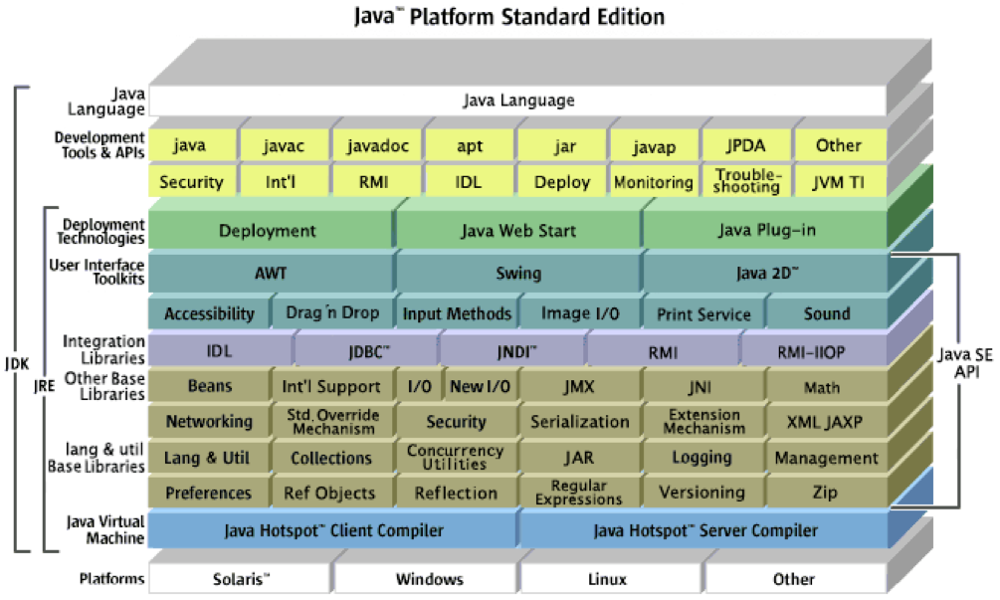

# Java Virtual Machine

*Partially derived with permission from Bill Venners’ excellent book, [Inside the Java virtual machine](http://www.artima.com/insidejvm/ed2/).*

## Architecture
Java has 4 key elements:

* language
* .class file format
* same API across machines
* virtual machine

Platform

* API/VM provide cross-platform execution
* VM isolates the program from x68, PPC, ...
* API mostly in Java with calls to native libraries via JNI

http://www.oracle.com/technetwork/java/whitepaper-135217.html

...

[class file viewer](https://github.com/amosshi/freeinternals)
