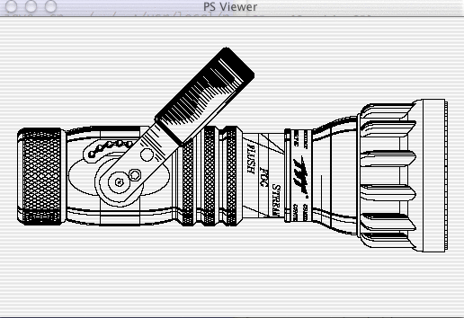

# PostScript case study

## Introduction

In this lecture, we will explore a simple interpreter architecture for a real language called PostScript, a page description language created by Adobe Systems circa 1982. PostScript (*PS*) is stack-based and all operands go onto a stack and results go back onto the stack. It has no keywords!

PDF (Acrobat) files are essentially a restricted form of PostScript that makes rendering more efficient, so postscript is an actively-used programming language. It is worthwhile learning how PostScript's interpreter works and how to code a little PostScript to impress your friends. The most interesting feature of PostScript is that it's a programming language, not a data file.

Postscript is very similar to the [Forth programming language](http://www.forth.org/) and is in the class of languages like SmallTalk and LISP that use programming language constructs to extend the language. Forth could add new operations at will, SmallTalk could add a new instance variable by calling a method (`addInstanceVar` or some such), a LISP program is essentially just data so you can do whatever you want. Java goes part of the way, by letting you query object definitions at run-time, but you cannot add an instance variables at run-time (you cannot define new keywords either).

PostScript is dynamically scoped (the set of visible symbols is determined at runtime not according to a lexical reference point) and likely the most common one still in use. Perl, Tcl, and TeX also still have dynamic scoping.

Just to give you a taste of the project associated with this lecture, you will build an interpreter for a simplified version of PostScript, but one that can actually draw pictures and so on. Your goal will be to get the interpreter functional enough to display the following:



From the language reference manual:

<blockquote>
The interpreter operates by executing a sequence of objects. The effect of executing
a particular object depends on that object’s type, attributes, and value. For
example, executing a number object causes the interpreter to push a copy of that
object on the operand stack (to be described shortly). Executing a name object
causes the interpreter to look up the name in a dictionary, fetch the associated
value, and execute it. Executing an operator object causes the interpreter to
perform a built-in action, such as adding two numbers or painting characters in
raster memory.

Every object is either literal or executable. This distinction comes into play when the interpreter attempts to execute the object.
<ul>
<li> If the object is literal, the interpreter treats it strictly as data and pushes it on
the operand stack for use as an operand of some subsequent operator.
<li>If the object is executable, the interpreter executes it.
</ul>
</blockquote>

## Crash-course on PostScript

Here are some useful links to tell you more about PS:

* [An introduction to PostScript (slides)](http://sus.ziti.uni-heidelberg.de/Lehre/Tools1213/PostScript_PeterFischer.pdf)
* [PostScript language reference](http://partners.adobe.com/public/developer/en/ps/PLRM.pdf)
* [The Blue Book](http://www-cdf.fnal.gov/offline/PostScript/BLUEBOOK.PDF)
* [Introduction to Postscript](http://www.eecs.wsu.edu/~hauser/teaching/Languages-F04/lectures/postscript.html)

A PostScript program must begin with a magic line and generally has a trailer that indicates "end of program":
```
%!PS-Adobe-3.0
... instructions ...
%%EOF
```
Single-line comments start with `%` and, hence, these "commands" are just special comments.

The grammatical structure of the language is so simple that you can summarize the executable instructions in one rule:
```
instruction : element* ;
```
where `element` can be code block names like `moveto`. The operand elements are typed: strings, integers, reals, identifiers, boolean (with true / false literals) or groups of operands. For example, here are some simple instructions:

```
% this is a comment
(this is a string) length     % (x) implies x is a string
5 2 add
[10 20 30] 1 get              % yields 20 (leaves on stack)
1.5 2 lt                      % yields true on the stack
3 6 add sqrt                  % gives 3 on the stack
```

Here is a simple PS program that draws a line up and to the right at 45 degrees:

```
%!PS-Adobe-2.0 EPSF-1.2
0 0 moveto
400 400 lineto
stroke
showpage
%%EOF
```

For testing, you can use the == operator that pops and prints the top of the stack (see more debugging commands below)
```
1.5 ==                        % displays 1.5 to standard out
```

### Useful operations

pop, dup, exch, count, clear

Define a variable: `/x 5 def` is `x=5`

`begin`..`end` push and pop a dictionary, effectively nesting the scope level.

### Control structures

What about control structures? Unlike bytecode interpreters, PS does not branch (move the program counter register). It is more high-level like LISP and just uses another operator (`if`) that operates on **code blocks** in curly braces:

```
3 4 lt {(it works!) ==} if
3 4 gt {3} {4} ifelse ==  % shows 4
```

In other words, if takes two operands on the stack: a boolean value (here computed by `3 4 lt`: "*is 3 less than 4*?") followed by a chunk of code to execute. Here, the code chunk displays `it works!` at the current x, y location. This is using *postfix* notation.

Simple repeat loops look like this:

```
n {code} repeat
```

Here's one that puts `hi` onto the stack four times:


```
4 {(hi)} repeat
```

The `for` loop puts the loop iteration variable onto the stack.

```
GS>1 1 5 {(hi)} for pstack
(hi)
5
(hi)
4
(hi)
3
(hi)
2
(hi)
1
1 1 5 {} for pstack
5
4
3
2
1
```

Code blocks are sequences of operands and operators enclosed in curly  braces; postscript calls them *procedures*. You will see this again in SmallTalk!

### Procedures

Even with the simplicity of these generic instructions, PS can define subroutines and call them. For example, here is a PS program that defines a procedure called `average` and uses it to average two numbers (the operands are assumed to be on the stack):

```
/average {add 2 div} def
20 40 average % The result on the top of the stack would be 30.0. 
```

Defining a function is just an assignment that happens the store a procedure, or code block, rather than a simple value like an integer or a string.

To store parameters in local variables, use `exch`:

```
/sum {
    /y exch def     % top of stack is the last parameter; need /y below value
    /x exch def
    x y add         % add values and leave the result on the stack
} def
```

```
GS>3 9 sum ==
12
```

**Higher-order functions**

Because we can pass code blocks around, we can have a function return a code block or we can pass a code block into a function. Here is a function that executes the procedure passed in:

```
/doit {exec} def
```

Then we can pass it anything executable, which includes a single item or a sequence enclosed in a procedure block:

```
3 doit                  % pushes 3 onto the stack
{ 0 0 moveto            % set the current graphics cursor
  (hi) show             % draw hi at 0,0
} doit                  % execute the procedure
```

Nothing is sacred or reserved in postscript--e.g., you could redefine `showpage` to be an empty operation. This would be useful for preventing encapsulated (embedded) postscript files from performing illegal operations:

```
% showpage normal here...
begin                  % begin local scope
/showpage { } def      % redefine showpage to be empty procedure
% showpage doesn't do anything anymore
...embedded postscript...
end                    % exit local scope
% showpage works again
```

**Recursion**

See [Recursion in PostScript](http://www.math.ubc.ca/~cass/graphics/manual/pdf/ch9.pdf).

```
/fact { % fact(n) = n * fact(n-1)
    1 dict begin                % enter local scope
        /n exch def             % save arg as n
        n 0 eq                  % if n==0
        {1}                     % return 1 by leaving on the stack
        {n n 1 sub fact mul}    % n * fact(n-1)
        ifelse
    end                         % exit local scope
} def
```

```
GS>3 fact ==
6
GS>4 fact ==
24
GS>5 fact ==
120
GS>6 fact ==
720
GS>7 fact == 
5040
GS>8 fact == 
40320
GS>9 fact ==
362880
GS>0 fact ==
1
```

### Late binding and scoping

For completeness, let me mention that PostScript uses *late binding* in general. For example, the following procedure references two operators, `add` and `div`:

```
/average {add 2 div} def
```

Upon each invocation of `add` and `div` in `average`, the interpreter must look up their definitions. Those operators are not keywords and you might have redefined them. You could, for example, have `add` redefine itself to be `sub` so that the next computation of average is wrong. 

To override this lazy evaluation, use bind to bind names to objects at `def`-time; during execution time, `add` and `div` are not looked up:

```
/average {add 2 div} bind def
```

*Procedures in PS do not automatically get local variable space.* For example,

```
GS>/foo {/y 1 def} def
GS>/y 3 def
GS>y ==
3
GS>foo
GS>y ==
1
```

Here is an example that defines a look scope in a procedure, stores the parameter into `y`, calls `foo`, and then leaves `y` on the stack. 

```
% From:
% http://digital.cs.usu.edu/~cdyreson/teaching/languages/142/lectures/printnames.htm
/y 3 def           % set "global" y = 3
/foo {
	1 dict begin
	   /y 1 def    % set local y = 1
	   y           % leave y on the stack as a return value
	end
	} def
GS>foo ==
1
GS>y ==
3
```

The question is: where does `foo` store `y`? Does it overwrite the global? No.

## Encapsulated PS
An encapsulated postscript file is simply a postscript file with a bounding box specification and a slight change to the magic first line (I don't think the `EPSF-3.0` is necessary):

```
%!PS-Adobe-3.0 EPSF-3.0
%%BoundingBox: 10 10 100 30
...
showpage
%%EOF
```

This basically restricts the region of the page that the postscript file writes into. This is used for embedding postscript files in other documents.

## Machine architecture

A postscript interpreter is a stack-based calculator that manipulates familiar objects such as strings, numbers, and arrays. But, since programs are just data to postscript, operators and procedures are also objects that you can manipulate.

A postscript program is a sequence of objects. When the interpreter encounters (executes) an operand, it pushes that object on the stack. When it sees a name, the interpreter looks up the definition and executes the associated object (which might be an integer or code chunk). Executing a name associated with a procedure is like calling a subprogram as execution of the current stream is temporarily suspended until the procedure's code chunk can be executed. "Executing" an atomic element like an integer, simply puts that integer on the stack.

### Tokens
For our purposes, we'll look at the following symbols:

| Symbol | Meaning |
|--------|--------|
|  (*some text*)      | *string*        |
|1.2 +2 6 -1.05 | *numbers* |
|[20 3 100 20] | *arrays*; execute elements right away |
|{add 2 div} | *procedure*. code chunk; deferred execution |
|moveto average foo | *names*. Names do not have values, but are rather associated with a value in a dictionary |
|/average | *literal*. Do not evaluate name (do not look up in dictionary), treat it as data; it is a symbolic reference to a value or procedure |

### Dictionaries

A dictionary is just a table that maps a key to a value. You can use them to associate a name with an object like an integer or array. Use the `def` operator to map a value (a name literal) with a value:

```
/Version 1.0 def
/foo [1 2 3] def
```

Works with procedures too:

```
/average
{add 2 div}
def
```

The proper way to think about the above instructions is:

*push literal symbol name* `average`
*push procedure object* `{add 2 div}`
*execute dictionary operator* `def`

To look up a symbol, just say its name: `Version`, which would push 1.0 on the stack, for example.

PostScript uses dictionaries for scoping and there is a stack of dictionaries to support nested scopes. First the system dictionary is pushed then the user dictionary. Symbols are looked up moving from top of stack down to the system dictionary. So, if you want another scope, just push another dictionary. For example,

```
GS>1 dict begin
GS>/x 3 def
GS>x ==
3
GS>end
GS>x ==
Error: /undefined in x
```

These are like global, function, local nested scopes in C. Because look up of symbols depends on the state of the dictionary stack, PS has *dynamic scoping*. To create local variables in a function, do this:

```
/f {
  5 dict          % make space for 5 locals
  begin           % push dict on dict stack
    ...           % def values in local dict
  end             % pop dict, back to previous "scope"
} def
```

### Stacks

PostScript has four stacks:

1. operand stack. Where operands and results are pushed/popped.
1. dictionary stack. Like the nested scopes of a conventional language.
1. execution stack. Holds procedure invocation stack frames.
1. graphics state stack. Used to save/restore the graphics state before/after chunks of postscript that you want to only temporarily modify the graphics state.

Objects are copied onto the stack when pushed, unless they are composite elements like arrays. In that case, a reference is pushed and so the data is shared.

### GhostScript in interactive mode

When exploring PostScript, it is useful to use the [GhostScript](http://www.ghostscript.com/) interpreter, which you can install with `brew install ghostscript` on mac. (If you get an error that it cannot find an image/lib, see the [fix](http://stackoverflow.com/questions/24690800/imagemagick-ghostscript-dyld-library-not-loaded-usr-local-lib-libjbig2dec)). On the other hand, I found that it wasn't working for me, possibly because of an X11 issue.  I installed [Richard Koch's GhostScript package](http://pages.uoregon.edu/koch/) and it worked. You will find the following commands useful:

* `=`: pop something off the stack and print a text representation.
* `==`: pop something off the stack and print a text representation, but print data structures and elements in PS syntax.
* `stack`: show the entire stack contents using `=`.
* `pstack`: show the entire stack contents using `==`.

### Text

To display text in PostScript, you must set a font and then use the show command on a text operand (assuming the current cursor is set to some x, y coordinate):

```
%!PS-Adobe-2.0
/Helvetica findfont
12 scalefont setfont
300 300 moveto
(hi Alex) show
showpage
%%EOF
```

### Graphics

Coordinate 0, 0 is the lower left of the page. here is a simple file that says hi Alex in a box:

```
%!PS-Adobe-3.0 EPSF-3.0
%%BoundingBox: 10 10 100 30
/Helvetica findfont
24 scalefont setfont
10 10 moveto
(hi Alex) show
10 10 moveto
10 30 lineto
100 30 lineto
100 10 lineto
10 10 lineto
stroke
showpage
%%EOF
```

The encapsulated PS image looks like:
