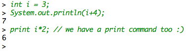
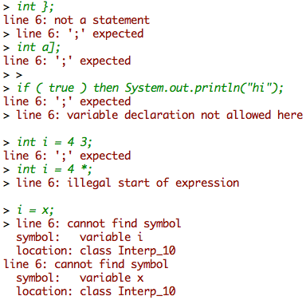
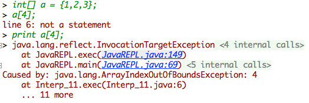
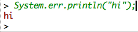

Java REPL
====

This project teaches you about dynamic compilation, class loaders, and simple lexical analysis (matching nested structures).  The project demonstrates that Java can be extremely dynamic. Servers use this technology all the time to reload classes without having to restart the server program. We'll build a read-eval-print loop (REPL) interface for Java code similar to Python's interactive shell.



## Goal

Your goal is to create an interactive "shell" tool that mimics the behavior of the Python interpreter shell. In other words you should be able to type the following, hit return, and see the result immediately:

```bash
$ java JavaREPL
> System.out.println("Hi");
Hi
^D
$
```

where ^D is "control-D". That sends end-of-file to standard input on UNIX. It's ^Z on Windows.

You should print a line with a "> " prompt for the user.

One of the tricky bits is figuring out when the user has finished typing a complete declaration or statement. For example, we would not want to have to type complete functions all on a single line. You'll notice that Python tracks the nesting level of parentheses, brackets, etc. and executes whenever it sees a newline and it is not nested or comment. Your should behave in a similar fashion:

```java
> // do nothing
> void f() {
    System.out.println("hi");
}
> f();
hi
> print (
3
+
4
);
7
> 
```

You do not have to worry about `/*...*/` comments, just the line comments that start with `//`.

You must allow variable definitions, function definitions, and class definitions as well as executable statements:

```java
> class T {
	int y;
	void f() {
		System.out.println("T:f");
	}
}
> T t = new T();
> t.f();
T:f
> 
```

Pretty cool, eh?!

Assume that the code entered by the user is restricted to use classes in:

```java
import java.io.*;
import java.util.*;
```

Before you freak out that you have to build a Java interpreter, note that my solution is less than 200 lines of code for the core functionality. Then, I have 100 lines of code for the scanner that figures out when the user has completed a statement or function or whatever.

For simplicity, I will use the term *line* to mean whatever complete declaration or statement the user types in from here on.

## How to build an interactive Java shell

Here's the trick you need to make this work without having to do much. When the user enters a statement or declaration (*line*), generate a class definition with that line and then compile it using Java's built-in compiler API; see packages `javax.tools.*`, `com.sun.source.util.JavacTask`. Once you compile the class just conjured up, use the `ClassLoader` to bring back code into memory and execute it.

Each line results in a new class definition, such as `class` name Interp_*i*. Each class inherits from the previous class, except for the first one of course which has no explicit superclass. For declarations, such as variables and functions, make them `static` members of the generated class. Put statements into a method some called such as `exec()`. For example, let's translate the following commands.

```java
int i = 3;
void f() { System.out.println(i); }
f();
```

We'd get the following class definitions:

```java
import java.io.*;
import java.util.*;
public class Interp_0 {
    public static int i = 3;
    public static void exec() {
    }
}
import java.io.*;
import java.util.*;
public class Interp_1 extends Interp_0 {
    public static void f() { System.out.println(i); }
    public static void exec() {
    }
}
import java.io.*;
import java.util.*;
public class Interp_2 extends Interp_1 {
    public static void exec() {
        f();
    }
}
```

There are 3 key elements here:

1. Inheritance allows us to see previously defined symbols.
2. The use of `static` variables and functions means that we don't have to create instances of objects.
3. We inject the user line in the proper place within the generated class depending on whether it is a declaration or an executable statement.

To distinguish between declarations and statements, we need a final trick.  Using the Java compiler API, try to parse the input line as a declaration. If it fails to parse, then it is either a syntax error or a statement. We assume it's a valid statement and then simply try to compile the line as a statement within the generated `exec()`. For example, if the user enters a print statement, try to parse it as a declaration:

```java
import java.io.*;
import java.util.*;
public class Bogus {
	public static System.err.println("hi");
	public static void exec() {
	}
}
```

(The name `Bogus` is just what I happen to use when generating code in an effort to distinguish between statements and declarations.)

The compiler will puke on this input obviously and your program should then try to compile it as a statement:

```java
import java.io.*;
import java.util.*;
public class Interp_0 {
	public static void exec() {
		System.err.println("hi");
	}
}
```

Finally, before you try to and analyze the Java code and executed, translate statements such as `print` *expr*`;` to `System.out.println(`*expr*`);`.   For simplicity, assume that this print statement only works as the first characters a line and only a complete statement, not nested within a function body for example. Assume it has a space after the `print` and before the expression.

###  Handling stderr and stdout

For invalid Java, or at least what we can't handle, the compiler will generate errors to `stderr`. The Java compiler API does not emit errors automatically to standard error so you must collect these messages and emit them yourself to `stderr`. Here are some examples (notice that the errors are not necessarily intuitive because of the way we generate classes with the user input.):



That colorization comes from the fact that I'm running it within the intellij console. From the regular command line running `java JavaREPL`, you would not see such colorization.

If there is an error during execution, the Java virtual machine will emit errors to `stderr` automatically and you don't have to do anything.



The Java code entered by the user might also generate `stderr` or `stdout`. You have to make sure that this output is still sent to the user. Fortunately, you don't have to do anything to make that happen. Because we are operating within the same process, and indeed the same thread, standard streams will go to their usual places. For example, you might see something like this:



###  Recognizing nested character streams

When the user types in a simple line like `int i;` it's easy to recognize they want you to execute that at the first newline, but we also want to handle the case of nested character streams with embedded newline's like:

```java
> int[] a = {
1,
2
};
> print a[0];
1
>
```

I created a class called `NestedReader` that tracks three things:

```java
public class NestedReader {
	StringBuilder buf;    // fill this as you process, character by character
	BufferedReader input; // where are we reading from?
	int c; // current character of lookahead; reset upon each getNestedString() call

	public NestedReader(BufferedReader input) {
		this.input = input;
	}
	public String getNestedString() throws IOException {
        ...
    }
}
```

A tricky issue is avoiding forcing the user to hit more than a single newline to indicate the interpreter should execute.  You will find that the best way to handle this is to keep a current character of *lookahead*, which I call field `c`. This is always the next character to process. When we consume a character, I add the character to my buffer and refill the lookahead character:

```java
void consume() throws IOException {
	buf.append((char)c);
	c = input.read();
}
```

The basic idea is as follows. When asked to do so, my code looks at each character in turn and processes it accordingly. If it is an opening curly brace, bracket, or parenthesis, I push the appropriate closing character onto a stack. Upon closing character, I checked the top of the stack to make sure that it's the right symbol. If not, I declare and improperly nested piece of code and return the current buffer to my JavaREPL. When I see the start of a string or character literal, I consume characters until the closing character. Upon `//`, I consume characters until the end of line and in fact I strip away these comments and do not send them to the compiler. Upon `\n` and an empty stack, I returned the current buffer to the invoking code otherwise I keep consuming characters.

## Requirements

Just to summarize, keep in mind the following requirements.

1. Your tool must be an interactive Java shell that executes user code when they hit newline when not nested inparentheses, square brackets, or curly brackets. Those characters are not counted when they are inside single or double quoted strings or within single-line comments.
1.  Accept as a declaration, anything that will compile with `public static` in front of it as a field of a class, which would include variable, function, and class definitions.
1. Your program must not require more than a single newline character after the end of a valid statement or declaration. In other words, I shouldn't have to hit extra newlines to make your program execute my code.
1.  Allow a blank line as a "do nothing" statement
1. Accept `print `*expr*`;` as a statement and converted to the usual Java `print()` call before processing.
1.  Comments on the end of the line should not present execution of the line:
`print "hi"; // a comment`.
1.  Anything that does not parse as a valid declaration, should be assumed to be a statement and compiled/executed as such.
1.  All code execution must occur within the same user thread and within the same process; i.e., you cannot use `Runtime.exec()` or anything like it to launch Java and another process. It won't do you any good but I wanted to prevent you from wasting time going down that path.
1. You must use the Java compiler API to parse and compile code.
1. You must use a `ClassLoader` to bring in the compiled class that you generate and then use standard reflection to execute that code (i.e., call `exec()` on the class object you bring in).
1. Users must see standard output and standard error as they would normally expect from compiler errors and run-time errors.
1. For improperly nested input, such as `(3+4]`, it's fine to just pass it off to the compiler and let it complain. But, you need to handle this case in your input scanner so it knows when to return input for processing.
1. Multiple statements or multiple declarations should work, such as `int i=3; int y;` but it should not handle a line that includes both a declaration and a statement because that would force the declaration to be a local variable.
1. Do not attempt to execute statements are declarations with compile errors.
1. Upon invalid and incomplete input such as `int {;`, keep waiting for the user to close with an improper symbol or with the proper symbol or hit eof. Your program should wait even if there are multiple new lines afterwards.
1. Upon an improperly nested string, consume until the end of line before attempting to read another statement from the user.
1. Exit your program when the user hits EOF (^D or ^Z, depending on the OS).
1. [Ask Java for a temp directory](http://stackoverflow.com/questions/617414/create-a-temporary-directory-in-java) to store your java files.

You are free to use Java 8, as that is how I will test your code.

As usual, you should try sending in all sorts of random input in an effort to make your program robust. Expect that I will do something like that during testing. If I were you, I would try sending in lots of random Java code to ensure your program operates correctly.

## Resources

You need to learn about compilation on-the-fly using Java's compiler API. **You are free to copy and use in your project any example code you find including Oracle javadoc but you must clearly delineate it in your code and provide the source from which you derived the bits of your solution.** Here are some pointers

* [JavaCompiler interface](http://docs.oracle.com/javase/7/docs/api/javax/tools/JavaCompiler.html)
* [Article on Java Compiler API](http://www.javabeat.net/the-java-6-0-compiler-api/)
* [How to compile java using javax](https://www.google.com/search?btnG=1&pws=0&q=how+to+compile+java+using+javax&gws_rd=ssl)
* [Compile a Java file with JavaCompiler](http://www.java2s.com/Code/Java/JDK-6/CompileaJavafilewithJavaCompiler.htm)

For example, I use this to get an in-memory Java compiler:

```java
JavaCompiler compiler = ToolProvider.getSystemJavaCompiler();
```

Then, using a `DiagnosticCollector` and a `StandardJavaFileManager`, I get a specific `CompilationTask` called `JavacTask` and then compile by calling `call()`. I pull any error messages out of the DiagnosticCollector. There are lots of simple versions of compilation like this on the net that you are free to copy and mangle for your projects (assuming you give proper attribution):

```java
...
JavaCompiler compiler = ToolProvider.getSystemJavaCompiler();
JavacTask task = (JavacTask)
	compiler.getTask(null, fileManager, diagnostics,
	compileOptions, null, compilationUnits);
boolean ok = task.call();
```

To check whether or not something is *syntactically* (but not *semantically*) valid, use the `parse()` method of the `JavacTask` class.
```java
public static boolean isDeclaration(String line) throws IOException {
   ...
   
   task.parse();
   return diagnostics.getDiagnostics().size() == 0;
}
```

Here's some information on dynamic class loading:

* http://tutorials.jenkov.com/java-reflection/dynamic-class-loading-reloading.html
* http://docs.oracle.com/javase/7/docs/api/java/lang/ClassLoader.html

I use `URLClassLoader` to load the compiled class then used `Class.getDeclaredMethod()` to find the `exec()` method.

If it helps, here is my list of methods

* main()
* isDeclaration()
* getCode()
* compile()
* exec()
* writeFile()

## Deliverables

You must deliver class `JavaREPL` that is in the default (i.e., unnamed) package and it must contains a `main()` method that embodies the interactive shell described above.  For example, you can see the starter kit I created here:

https://github.com/USF-CS652-S15/parrt-repl

Make sure your repository has any other classes needed for this project.

Do not add `.class` files or any other build artifacts.

## Submission

You must submit your project via github using your account and the repository I've created for you in organization [USF-CS652-S15](https://github.com/USF-CS652-S15).
