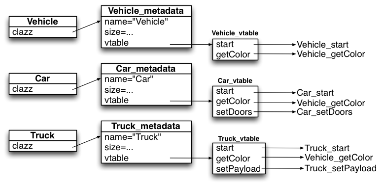
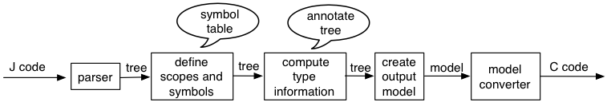
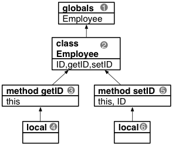
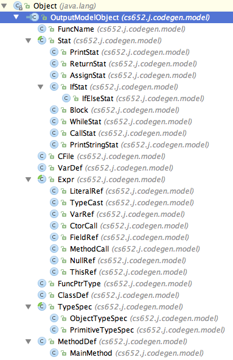

# Translating a subset of Java to C

## Goal

In this project, you must translate a very small subset of Java to pure C using ANTLR, StringTemplate, and Java code that you write. The subset has very few statements and almost no expressions, focusing instead on classes and methods. You will learn not only about  language translation but also how polymorphism in dynamic dispatch is implemented using so-called vtables, which C++ uses. It requires a deep understanding of C pointer types as well.

To get started, please familiarize yourself with the [Java translator starter kit](https://github.com/USF-CS652-starterkits/parrt-vtable). The main program is `JTran.java`.

## Discussion

### Sample input

To get a flavor of the Java subset, take a look at the following `.j` files, which demonstrate all of the tricky polymorphism and dynamic binding your translated C code must implement.

```java
// tests/cs652/j/polymorph.j
class Animal {
    int ID;
    int getID() { return ID; }
    void speak() { printf("%d\n", getID()); }
}

class Dog extends Animal {
    void speak() { printf("woof!\n"); }
}

Animal a;
Dog d;
d = new Dog();
a = d; // should cast to Animal *
a.speak(); // prints woof!
d.speak(); // prints woof!
```

Check out the [expected C code](https://github.com/USF-CS652-starterkits/parrt-vtable/blob/master/tests/cs652/j/polymorph.c).

```java
// tests/cs652/j/vtable_check.j
class Animal {
    int getID() { return 1; }
    int foo() { return getID(); }
}

class Dog extends Animal {
    int getID() { return 2; }
}

class Pekinese extends Dog {
    int getID() { return 3; }
}

Pekinese d;
d = new Pekinese();
printf("%d\n", d.foo()); // must print 3
```

Check out the [expected C code](https://github.com/USF-CS652-starterkits/parrt-vtable/blob/master/tests/cs652/j/vtable_check.c).

A file consists of zero or more class definitions file optionally by a main program followed by end of file:

```
grammar J;

file:   classDeclaration* main EOF
    ;
```

You can see all of the [sample inputs I used for testing](https://github.com/USF-CS652-starterkits/parrt-vtable/tree/master/tests/cs652/j).

### Translation to C

There are very few expression and statement constructs that you need to translate. This project is all about the translation of classes to `struct`s and methods to functions. One of the trickiest part is converting the flexible Java type system to C's much stricter type system. For example, in Java an Animal reference can point at a Dog but not in C. We have to typecast any assignment right hand side and parameter expression (an implicit assignment).  We also have to deal with function pointers so you should read the following carefully: [How To Read C Declarations](http://blog.parr.us/2014/12/29/how-to-read-c-declarations/).

#### Boilerplate support code

For simplicity, generate all of the support code at the start of each file:

```c
#include <stdio.h>
#include <stdlib.h>

typedef struct {
    char *name;
    int size;
    // _vtable is pointer to an array of pointers to functions returning void
    void (*(*_vtable)[])();
} metadata;

typedef struct {
    metadata *clazz;
} object;

object *alloc(metadata *clazz) {
    object *p = malloc(clazz->size);
    p->clazz = clazz;
    return p;
}
```

`metadata` records information about a class definition, including its name, how many bytes are required to hold an instance of that class, and finally its vtable.

Each instance of a class starts with a single pointer of overhead, a pointer to its class definition "object" called `class`. This memory template is described by `object`. All instances that have data fields will be bigger than `object` by using this `struct` allows us to access any objects class definition pointer. To make a method call, we need to access the receiver objects vtable.

Finally, we have a function that allocates space for an instance of a class: `alloc`. It takes class definition metadata and returns an object of the appropriate size with its class definition pointer set.  Constructor expressions such as `new Dog()` become calls to `alloc` with a typecast on the result so that it is appropriately typed for C code.

```c
((Dog *)alloc(&Dog_metadata))
```

#### Classes with fields

Classes in J become `struct`s in C and the translation is pretty simple.

<table border="0">
<tr><th><b>J</b></th><th><b>C</b></th></tr>
<tr>
<td><pre>
class T {
    int x;
    Dog y;
}
</td>
<td>
<pre>
// D e f i n e  C l a s s  T
typedef struct {
    metadata *clazz;
    int x;
    Dog *y;
} T;
</td>
</tr>
</table>

Don't forget the `metadata` pointer. It allows every object to know its type at runtime. Most importantly, it is through this class definition object that we can access the vtable to do method calls. (More later on method calls.)

Every reference to a field `x` within a method is really `this.x` and so field references inside methods are converted to `this->x` where `this` is the first argument of each function we define for each J method.

Accesses to fields outside are always through an object reference. `o.x` &rarr; `o->x`.

#### Inheritance of fields

C does not support inheritance of `struct`s and so your translator needs to copy fields from all superclasses into subclasses. For example,

<table border="0">
<tr><th><b>J</b></th><th><b>C</b></th></tr>
<tr>
<td><pre>
class Animal {
    int ID;
}
class Dog extends Animal {
    int legs;
}
</td>
<td>
<pre>typedef struct {
    metadata *clazz;
    int ID;
} Animal;
typedef struct {
    metadata *clazz;
    int ID;
    int legs;
} Dog;
</td>
</tr>
</table>

The order of inherited fields must be preserved in `struct`s for subclasses so that a reference to an object through any pointer type will access the same field offset. Any fields added in a subclass must appear after the inherited attributes.

#### Main programs

The statements and local variable declarations of a J program translate to the body of a `main` function in C:

<table border="0">
<tr><th><b>J</b></th><th><b>C</b></th></tr>
<tr>
<td><pre>int x;
x = 1;
printf("%d\n", x);
</td>
<td>
<pre>int main(int argc, char *argv[])
{
    int x;
    x = 1;
    printf("%d\n", x);
}
</td>
</tr>
</table>

#### Polymorphism

Polymorphism is the ability to have a single pointer refer to multiple types. In Java, references to an identifier of type `T` become pointers to `T` in C: `Dog d;` &rarr; `Dog *d;`. Consider the following J code with an assignment of a `Dog` to reference an `Animal` reference.

<table border="0">
<tr><th><b>J</b></th><th><b>C</b></th></tr>
<tr>
<td><pre>
Animal a;
Dog d;
d = new Dog();
a = d; // should cast to Animal *
</td>
<td>
<pre>
Animal *a;
Dog *d;
d = ((Dog *)alloc(&Dog_metadata));
a = ((Animal *)d);
</td>
</tr>
</table>

The C code requires a cast in the assignment, as you can see in the last C statement.  `Animal *` and `Dog *` are never compatible in C and so we need the typecast. We are naturally just doing a pointer assignment but we have to hush the C compiler.

#### Method translation

Methods translate to functions in C. To distinguish between methods with the same name in different classes, we prefix the C function name with the class name: `foo` &rarr; `T_foo` for method `foo` in class `T`. Each C function also takes the receiver object as an additional first argument as shown in the following translation.

<table border="0">
<tr><th><b>J</b></th><th><b>C</b></th></tr>
<tr>
<td><pre>
class T {
    void foo() { printf("hi\n"); }
}
</td>
<td>
<pre>
typedef struct {
    metadata *clazz;
} T;
void T_foo(T *this)
{
    printf("hi\n");
}
</td>
</tr>
</table>

To access field `x` from method `foo`, the compiler assumes `this.x`, which is then translated to `this->x` in the generated code. For example, method `getID` that accesses field `ID` gets translated like this:

```c
int Animal_getID(Animal *this)
{
    return this->ID;
}
```

#### Late binding (dynamic method dispatch)

According to [Wikipedia](http://en.wikipedia.org/wiki/Dynamic_dispatch), "dynamic dispatch is the process of selecting which implementation of a polymorphic operation (method or function) to call at run time." I think of this as sending messages to a receiver object that determines how to respond ala SmallTalk.

Method invocation expressions in Java such as `o.m(args)` are executed as follows:

1.	Ask `o` for its type (class name); call it `T`.
2.	Load `T.class` if `T` is not already loaded.
3.	Ask `T` to find an implementation for method `m`. If `T` does not define an implementation, `T` checks its superclass, and its superclass until an implementation is found.
4.	Invoke method `m` with the argument list, `args`, and also pass `o` to the method, which will become the `this` parameter for method `m`.

In C++, and in our translation of Java, we will do something very similar but of course we do not need to load `T` dynamically. Let's go through an example to figure out how to implement dynamic binding of methods:

```java
class Vehicle { // implicit extends Object
    void start() { }
    int getColor() { return 9; }
}
class Car extends Vehicle {
    void start() { }
    void setDoors(int n) { }
}
class Truck extends Vehicle {
    void start() { }
    void setPayload(int n) { }
}
```

Both `Car` and `Truck` inherit `getColor`.

If I have a `Vehicle` reference and send it message `start`, we need to figure out whether to execute `Truck`'s `start` or `Vehicle`'s version. Always remember that the receiver dictates how to respond to a message/method. Consider the following J code.

```java
Vehicle v;
Truck t = new Truck();
v = t;
t.start();
v.start(); // same thing as t.start() in this case
```

From above, we know that the `start` methods will be translated to  multiple C functions such as:

```c
void Vehicle_start(Vehicle *this) { }
void Truck_start(Truck *this) { }
```

Given a vehicle reference, `v`, you might be tempted to simply call `Truck_start(v)` but that would be static binding not dynamic binding. We need to do the equivalent of testing the type of object  pointed at by `v` and then call the appropriate function implementation. A more sophisticated way to do that is through a function pointer. In the following possible translation (not the way we will eventually do it), we use a function pointer that points at the appropriate function.

```c
typedef struct {
    metadata *clazz;
    void (*start)(); // set this to &Vehicle_start
    ...
} Vehicle;
typedef struct {
    metadata *clazz;
    void (*start)(); // set this to &Truck_start
    ...
} Truck;
```

(It is important that the `start` function pointer sit at the same offset in each struct.)

Then, the translation of method calls to function calls becomes an indirection through a function pointer:

<table border="0">
<tr><th><b>J</b></th><th><b>C</b></th></tr>
<tr>
<td><pre>t.start();
v.start();
</td>
<td>
<pre>(*t->start)(t);
(*v->start)(v);
</td>
</tr>
</table>

Unfortunately this is a big waste of memory because each instance of a class requires a pointer for each method defined in the class, instead of just space for the declared fields. As the diagram here shows, it's better to factor out all those pointers as they are known statically at compile time. Then, each object simply needs a pointer to the appropriate table of method pointers, which we call a vtable:



In our case, we will access the vtable through the `clazz` field: `o->clazz->_vtable`.

Each new method name in a class hierarchy gets a new *slot* number, which corresponds to the position within the vtable. The order in which subclasses define overridden methods does not matter, they still need to have the same slot number as defined by the superclass method definition. For example, switching the order of the methods in `Truck` should have no effect on the vtable order as the order of slot was defined in the superclass.

```java
class Truck extends Vehicle {
    void setPayload(int n) { }      // slot 2
    void start() { }				// slot 0 per class Vehicle
}
```

Here are the vtables for the three classes:

```c
void (*Vehicle_vtable[])() = {
    (void (*)())&Vehicle_start,
    (void (*)())&Vehicle_getColor
};
void (*Car_vtable[])() = {
    (void (*)())&Car_start,
    (void (*)())&Vehicle_getColor,
    (void (*)())&Car_setDoors
};
void (*Truck_vtable[])() = {
    (void (*)())&Truck_start,
    (void (*)())&Vehicle_getColor,
    (void (*)())&Truck_setPayload
};
```

The `(void (*)())` cast reads as "a pointer to a function returning `void`" and converts any function pointer to a standard function pointer we use for the vtable. We will have to cast these back to the real function pointers with appropriate parameter and return types when we make method calls.

#### Method calls

To make our lives easier, we use constants instead of raw slot numbers. For the classes above, we get the following slots (note how they line up for the inheritance hierarchy).

```c
#define Vehicle_start_SLOT 0
#define Vehicle_getColor_SLOT 1

#define Car_start_SLOT 0
#define Car_getColor_SLOT 1
#define Car_setDoors_SLOT 2

#define Truck_start_SLOT 0
#define Truck_getColor_SLOT 1
#define Truck_setPayload_SLOT 2
```

Notice how the method name slots all line up.

Given pointer to `Truck`, `t`, we use `t->clazz->_vtable` to access its vtable, but it's important to point out that `t->clazz->_vtable` is a pointer to a vtable not the actual the table. So, we need `*t->clazz->_vtable` to get to the actual vtable, which is an array of pointers to functions returning `void`.

Because a vtable is an array of pointers to functions so we need something like `vtable[Truck_start_SLOT]` to get a pointer to the `Truck_start` function. Since that is a function pointer, we need to dereference it to get a function, which means adding `()` on the end to make it a function call: `(*vtable[Truck_start_SLOT])()`. Since our vtable is actually `*t->clazz->_vtable`, we need the following translation to call method `start`, given a pointer to an object `t`.


<table border="0">
<tr><th><b>J</b></th><th><b>C</b></th></tr>
<tr>
<td><pre>
t.start()
</td>
<td>
<pre>
(*(*t->clazz->_vtable)[Truck_start_SLOT])(t)
</td>
</tr>
</table>

Note that of course we need to pass the `this` pointer. In my translations, you will notice that the `t` argument is explicitly cast to `((Truck *)t)`. This is not technically necessary because the `this` pointer will always be of the appropriate type. However, I have a general mechanism that computes casts for any parameters and it just happens to make the implicit parameter explicitly typed. It was easier to do a general translation.

But now we have to get the types right for C. Before calling a function through a function pointer, we have to cast the function pointer to the appropriate type, which includes the return type and all argument types including the `this` argument:

*return-type* `(*)(`*object-type*, *arg-types*`)`

```c
<return-type> (*)(<object-type>, <arg-types>)
```

A cast to this type would simply have parentheses around the whole thing:

```c
(<return-type> (*)(<object-type>, <arg-types>))
```

Method `start` returns nothing and has no defined arguments but an implicit `Truck *this` argument, giving typecast:

```c
(void (*)(Truck *))
```

Method `setPayload` returns nothing but takes an integer argument; its cast is:


```c
(void (*)(Truck *,int))
```

Method `getColor` returns an integer but has no explicit parameters:

```c
(int (*)(Vehicle *))
```

Putting it all together now we get the following translations.

```c
// t.start();
(*(void (*)(Truck *))(*(t)->clazz->_vtable)[Truck_start_SLOT])(((Truck *)t));

// t.setPayload(32);
(*(void (*)(Truck *,int))(*(t)->clazz->_vtable)[Truck_setPayload_SLOT])(((Truck *)t),32);

// int x; x = t.getColor();
int x;
x = (*(int (*)(Truck *))(*(t)->clazz->_vtable)[Truck_getColor_SLOT])(((Truck *)t));
```

Notice how all of the slot numbers are relative to `Truck`. That is because the type of the receiver object, `t`, statically is `Truck`. Notice how the translation changes when we call the same `start` method by using a `Vehicle` reference not a `Truck` reference:

```c
v.start();
(*(void (*)(Vehicle *))(*v->clazz->_vtable)[Vehicle_start_SLOT])(((Vehicle *)v));
```

To my surprise, when I left off the types of the arguments in my typecast, the function call ignored my parameters during execution. It must be some sort of compiler optimization.

In comparison, the other translations are straightforward and easily discernible from looking at the input-output pairs in the test directory.

## Tasks

The following diagram illustrates the overall flow of your translation. 



We take in J code and parse it into a parse tree using ANTLR. Then we walk the parse tree with a tree listener that defines symbols and scopes for our symbol table. It annotates the parse tree with pointers to the leaves of the scope tree so that we can recoup that information during subsequent tree passes.

Once we have all of the symbols defined, we can walk the parse tree again to evaluate the type of all expressions. As we descend the tree, we need to maintain a `currentScope` pointer so that we can look up functions and variables to determine their type. I have factored out this functionality into a listener called `SetScopes.java` but you don't have to do that. Annotate the tree with type information for every subexpression and expression. We will need this information during translation so that we can create the appropriate casts and use the appropriate slot numbers.

Once we have all of the information we need, we construct a model of the output that yields a model hierarchy or tree. For example, the root is a `CFile` object that contains a list of `ClassDef` model objects and a `MainMethod` model object. In a sense, you are building a parse tree of the output you want.

Once you have the complete output model constructed, it's a simple matter of walking that hierarchy and generating output for each element. It is so regular that we can do this automatically using the `ModelConverter` object I have provided for you. Given a model hierarchy, it returns a hierarchy of templates. To generate actual text, we just have to call `render()` on that hierarchy of templates. The output should be written to a file according to the command line arguments to `JTrans`.

### Creating the J grammar

Your must fill in the `J.g4` grammar by looking at all of the examples and the standard [ANTLR Java grammar](https://github.com/antlr/grammars-v4/blob/master/java/Java.g4). (I used as a template to cut it down to my `J.g4`.) Learning how to examine exemplars of a language and construct a suitable grammar is important but here are a few details that matter in terms of symbol table management and type analysis.

* Assume all input is syntactically and semantically valid J(ava) code with the exception that statements existing outside of class definitions are considered the main program. Other than that, assume Java syntax and semantics.
* Support method and field inheritance.
* Support method overriding but not overloading.
* Only integers and floating-point literals are valid. For floating-point numbers, don't worry about negation or exponents: just match and integer on either side of a decimal point.
* Identifiers are just the usual upper and lowercase letters, underscores, and digits (but not in the first position).
* Allow `null` and `this`
* Constructor definitions are not allowed but we still use syntax `new T()` (without parameters) to create objects.
* There are no access modifiers like `public`; everything is assumed to be `public`.
* To print things out there is a single predefined function called `printf(STRING)` or with variable number of arguments `print(STRING, args...)`.
* String literals are only allowed as the first argument of `printf()` calls. Strings should allow a single escape of `\"` but none other.
* There are no variable initializers like `int x=1;`. You must do `int x; x=1;`.
* There are no operators and so you don't have to worry about operator precedence but you do have to support criticize expressions for grouping.
* `void` methods are allowed.
* `this.foo()` and `foo()` methods calls are allowed inside class definitions but not `super`.
* `a.b.c.foo()` style calls are allowed outside of classes and inside methods of classes.
* `t.y` and `this.y` and `y` field access is allowed inside methods and `t.y` is allowed outside of methods. `x` without qualifications is a local variable outside of a method (and could be within a method).

### Defining scopes and symbols

1. Define J symbol table objects using `src/org/antlr/symbols` objects as superclasses as necessary:
	JArg.java
	JClass.java
	JField.java
	JMethod.java
	JVar.java

1. JObjectType.java
	JPrimitiveType.java
1. `DefineScopesAndSymbols.java`




### Computing expression types

3. `SetScopes.java`
4. `ComputeTypes.java`

### Constructing a model

In the `C.stg` template group file, you will see the stubs for all of the templates that I personally used in my translation:

```
ClassDef(class, fields, methods, vtable) ::= <<
>>

MethodDef(m,funcName,returnType,args,body) ::= <<
>>

MainMethod(main,funcName,returnType,args,body) ::= <<
>>

Block(block, locals, instrs) ::= <<
>>

VarDef(var, type)   ::= ""
...
```

These correspond to model objects with the same name:



### Generating C code from the model

The `ModelConverter` is an automated tool that I use for ANTLR and it is pure magic. It automatically converts an output model tree full of `OutputModelObject` objects to a template hierarchy by walking the output model (depth-first walk). Each output model object has a corresponding template of the same name.  An output model object can have nested objects identified by annotation `@ModelElement` in the class definition.  The model converter automatically creates templates for these fields and ads than is attributes to the template for the current model object. For example, here is the root of the output model hierarchy:

```java
public class CFile extends OutputModelObject {
    public final String fileName;
    @ModelElement public List<ClassDef> classes = new ArrayList<>();
    @ModelElement public MainMethod main;

    public CFile(String fileName) {
        this.fileName = fileName;
    }   
}
```

The model converter assumes that the corresponding template has a parameter for the actual `OutputModelObject` object, followed by the names of any nested model elements. In this case, the corresponding template looks like this:

```
CFile(f, classes, main) ::= <<
#include \<stdio.h>
...
<classes>

<main>
>>
```

The first object, however we name it, is always set to the model object associated with the template.

|Confusion point|
|-------------|
|*The parameters associated with the nested model objects are templates not output model objects!* For example, `f` is a `CFile` but `classes` is an instance of a template called `ClassDef` and `main` is an instance of a template called `MainMethod`. So, `<f.name>` yields the `name` field of a `CFile` model object but `<main.foo>` will not give you access to the `foo` field of model object `MainMethod`--it is a template not a model object. Please keep this in mind; it even catches me once in a while.|

This simple mechanism means we don't have to include code in every output model object that says how to create the corresponding template. One can imagine adding a `toTemplate` method to every output model object but it is inferior to this automated mechanism.


## Testing

**Assumes that you have Gnu [`gindent`](http://www.gnu.org/software/indent/manual) installed.** On a Mac this is easy to do:

```bash
$ brew install gnu-indent on mac os x
```

All [sample inputs I used for testing](https://github.com/USF-CS652-starterkits/parrt-vtable/tree/master/tests/cs652/j) are available. For each test `T`, you will find `T.j`, `T.c`, and `T.txt` where `T.txt` is the expected output after you compile and execute the program. You can run all of the tests like this:

```bash
./bild.py -debug tests
```

Remember, the definition of “working” is when your grammar correctly parses all of the .j files. If you use the -tree option from the command line with JTran.java that I provide, it will pop up a visual of the parse tree for you.
