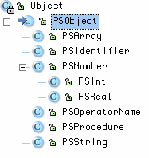

# PostScript interpreter

In this project, you will build an interpreter for a simplified version of PostScript, but one that can actually draw pictures and text. Your goal is to get the interpreter functional enough to display the following:


I have largely provided the interpreter for you, but you must complete the ANTLR grammar that reads in postscript files and makes calls to the interpreter. Here are the files: zip of PostScript interpreter resources

## The overall structure
A main program, Main.java, creates a visible Frame (a window) that your interpreter will pretend is the printed page. When you resize the window the image inside will resize as well. The main program creates Interp object attached to an input file passed as an argument on the command line.
The interpreter itself, Interp.java, has the system elements you would expect given our discussion above about stacks and dictionaries.

```java
public class Interp extends Canvas {
    public GraphicState gstate = null;

    /** Holds dictionary scopes */
    public Stack dictionaryStack = new Stack();

    /** Default system dictionary with predefined operators */
    public Hashtable systemdict = new Hashtable();

    /** User-level dictionary where procedures / variables defined */
    public Hashtable userdict = new Hashtable();

    /** Hold operand objects */
    public Stack operandStack = new Stack();
    ...
}
```

## Interface to the parser

The operators will manipulate these entities. Your parser will only need to invoke one of two methods to actually make this whole thing work:

```java
/** Push a postscript object onto the operand stack */
public void push(Object operand) {...}

/** Execute operator or user-defined procedure identified by 'name' */
public void execute(String name) {...}
```

## Control-flow
Notice that the interpreter is a kind of Canvas so that Interp has a paint() method that is called whenever the surrounding window (the one created in Main ) needs to redraw. The part of paint() you care about is:

```java
ANTLRFileStream in = new ANTLRFileStream(fileName);
EPSLexer lexer = new EPSLexer(in);
CommonTokenStream tokens = new CommonTokenStream(lexer);
EPSParser parser = new EPSParser(tokens, this);
parser.epsfile();
```

In other words, a request to paint the image window asks your parser to start up and process the input. Your parser, in turn, will communicate with the interpreter to push operands and execute instructions.

## What it can do

The cool looking nozzle (which I took from the Java 2D examples owned by Sun Microsystems) requires remarkably few instructions to render. They are:

```
stroke
load
def
moveto
lineto
showpage
```

It starts out like this

```
%!PS-Adobe-1.0
% File produced by AutoCAD
/m /moveto load def
/l /lineto load def
%%EndProlog
0.25 dup scale

917 871 m
921 868 l
927 868 l
...
```

The key thing to notice is that

```
/m /moveto load def
```

defines an operator m to be an alias for moveto . /moveto load asks the current directory to push the definition for moveto which is the procedure to actually do the move. Then the surrounding def instruction associates m with that move procedure.

Our interpreter ignores the dup and scale as it doesn't know those predefined operators.

## Operators

The operators are all implemented in package ps.operators and are subclasses of ps.operators.Operator . The subclasses all implement
```java
public abstract void execute(Interp interpreter);
```

That method can push/pop a value off the operand stack with Interp.push() / Interp.pop() .

## Operands

The data objects are subclasses of ps.PSObject such as ps.PSInt and ps.PSIdentifier. Here is the hierarchy:



and a description of what they are for:

``
class
purpose
PSString
a string
PSInt
holds an int
PSReal
holds a float
PSNumber
Just a super class of the numbers so I ask for the float value conveniently.
PSIdentifier
holds a literal name reference like /average . Corresponds to token ID in the grammar.
PSArray
an array of operands (can have nested arrays); not needed for this lab.
PSProcedure
an executable array of operands and operator names in 
curly braces {...} 
; not needed for this lab
```

You will create these objects in your parser and ask the interpreter to do something with them.

Goal: The parser
The ANTLR grammar file has a complete lexer and all infrastructure statements needed to make it fit into the existing interpreter. All you have to do is figure out what the grammar for postscript should look like using epsfile as a start rule.
You will then need to add actions to# create and push operands# execute operators
Here is a sample of object creation:
operand returns [Object o]
    :
   ...
    |   r=REAL      {$o=new PSReal($r.text);}
   ...
    ;
You have access to a variable in the parser called interpreter that you use to access the push() and execute() methods.
You must implement the dowhile operator and PSBoolean plus le operator type to make it work. So 9 10 le pushes a true PSBoolean onto the operand stack. Add print too so we can see values w/o worrying about the drawn page.

```
%!PS
/Helvetica findfont
24 scalefont setfont
/i 1 def
{i 10 le} {
    i print
    /i i 1 add def % i++
} dowhile
showpage
%%EOF
```

dowhile takes 2 procedures as operands.

Test files
I would examine the following test files and use them as a guide for understanding and then abstracting the grammar:
File test.ps should draw a line from 0,0 to 400 400:
```
%!PS-Adobe-2.0 EPSF-1.2
0 0 moveto
400 400 lineto
stroke
showpage
%%EOF
```

File def.ps should draw a line from 0,100 to 300,300:

```
%!PS-Adobe-2.0 EPSF-1.2
/foo 300 def
0 100 moveto
foo foo lineto
stroke
showpage
%%EOF
```

Then try out the nozzle.ps file of course.

More tests:
```
%!PS-Adobe-2.0 EPSF-1.2
0 0 moveto
400 400 lineto
stroke
showpage
%%EOF
```
```
%!PS
/Helvetica findfont
24 scalefont setfont
10 100 moveto
3 { (Testing repeat loop) show -40 40 rmoveto } repeat
%%EOF
```
```
%!PS-Adobe-3.0 EPSF-3.0
/Helvetica findfont
24 scalefont setfont
10 10 moveto
(hi Alex) show
10 10 moveto
10 50 lineto
150 50 lineto
150 10 lineto
10 10 lineto
stroke
showpage
%%EOF
```
```
%!PS
10 10 moveto
/Helvetica findfont
24 scalefont setfont
0 1 10 {
(hi) show
} for
showpage
%%EOF
```
```
%!PS
% 18-pt spacing, 24 lines
/Helvetica findfont
24 scalefont setfont
0 18 18 24 mul { %for
dup 0 moveto
600 lineto
} for stroke
% 18-pt spacing, 36 lines
0 18 18 42 mul { %for
dup 0 exch moveto
436 exch lineto
} for stroke
%%EOF
```

Using ANTLR
$ java org.antlr.Tool EPS.g
$ javac *.java

Ignore that warning...it does the right thing.

## Submission

You will create a jar file called ps.jar containing source, grammar, and *.class files and place in your build directory:
https://www/svn/userid/cs652/ps/build/ps.jar
I will run your code by executing the following:

```bash
$ java -cp "ps.jar:antlr-3.3.jar:$CLASSPATH" Main test.ps
```

NOTE THAT IT READS FROM THAT FILE NOT FROM STDIN
