# Smalltalk (*subset*) Virtual Machine

## Goal

The goal of this project is to build an interpreter / virtual machine (VM) for a subset of Smalltalk compiled by your Smalltalk compiler.   Your interpreter will read in JSON-formatted `.sto` bytecode files and execute them starting at method `main` in class `MainClass`.

```bash
$ stc test.st # has code "Transcript show: 'hello'." yields MainClass.sto
$ stvm -trace MainClass.sto 
0000:  push_global    'Transcript'      MainClass>>main[][a TranscriptStream]
0003:  push_literal   'hello'           MainClass>>main[][a TranscriptStream, 'hello']
0006:  send           1, 'show:'        MainClass>>main[][a TranscriptStream]
hello
0011:  pop                              MainClass>>main[][]
0012:  self                             MainClass>>main[][a MainClass]
0013:  return                           
```

For ease of testing, the junit tests reuse your compiler from the previous project. E.g., here is a sample test:

```java
@Test public void testAssign() {
	String input =
		"| x |\n" +
		"x := 1." +
		"^x";
	String expecting = "1";
	execAndCheck(input, expecting); // compile and exec
}
```

## Representing bytecode

In [Bytecode.java](https://github.com/USF-CS652-starterkits/parrt-smalltalk/blob/master/src/smalltalk/vm/Bytecode.java), you will see the definitions of the various bytecodes. Each instruction above gets its own unique integer "op code". There is also a definition of how many operands and the operand sizes so that we can disassemble code. For example, here is a class with a simple method:

```
class T [
	|x|
	foo [|y| x := y.]
]
```

and the bytecode generated for method `foo`:
```
0000:  push_local     0, 0
0005:  store_field    0
0008:  pop
0009:  self             
0010:  return           
```

The numbers on the left are the byte addresses of the instructions. The first instruction takes five bytes because there is one byte for the [`push_local`](https://github.com/USF-CS652-starterkits/parrt-smalltalk/blob/master/src/smalltalk/vm/Bytecode.java#L66) instruction and [two operands](https://github.com/USF-CS652-starterkits/parrt-smalltalk/blob/master/src/smalltalk/vm/Bytecode.java#L96) that are each two bytes long.

### Method contexts

The most challenging part of the Smalltalk VM is properly handling message sends and block evaluation.  It all comes down to `BlockContext` objects, which represent the execution of a `STCompiledBlock` in response to a message send. The context holds the `locals` (with arguments first) and operand `stack` for computation.  It knows where it is within the method code block (field `ip`) and what `receiver` it's executing the method for. The virtual machine always keeps a pointer to the active context, `ctx`. Pushing and popping contexts is analogous to pushing and popping scopes when we do simple table management.

Let's take a look at a sequence of images that depict the context stack as it changes during the execution of a simple method, `f`, that returns the addition of two numbers. Here's what the active context looks like after the two integers have been pushed onto the stack:

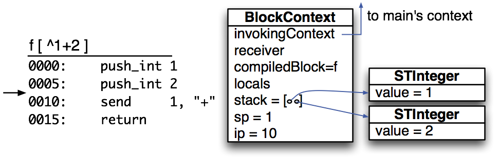

Then, during the execution of the message send, `+`, the context stack looks like the following (assuming `+` is not primitive for the sake of this demonstration):

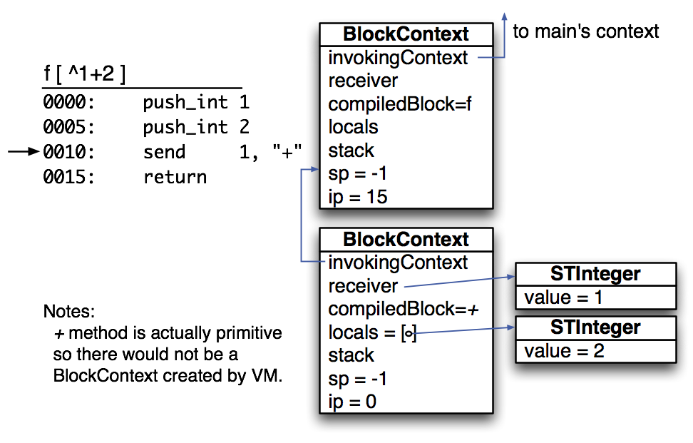

The new `BlockContext` has its own instruction pointer and stack for operands. After the `+` message send finishes, its return value will be on the operand stack of the invoking context, which is `f` in this case:

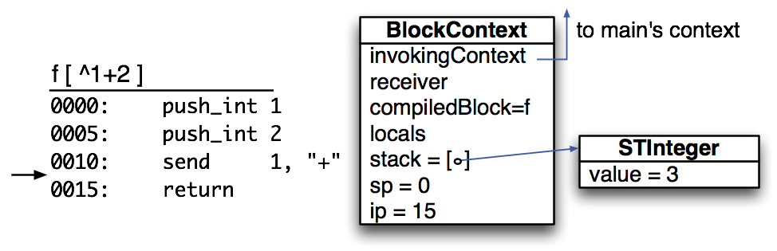

### Block contexts

Now let's turn to a sample block evaluation.  To evaluate a block, the `BLOCK` bytecode pushes a `BlockDescriptor` object as a kind of prototype for the context we want to create.

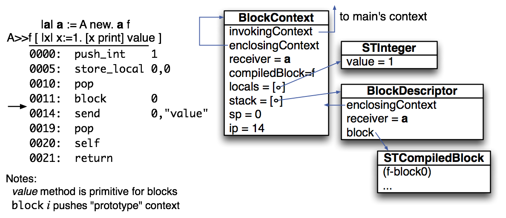

**BLOCK instruction**. This instruction is critical to understanding how Smalltalk executes code. The `BLOCK` instruction pushes a `BlockDescriptor` onto the operand stack of the active context and is like a function pointer to a block or method. There are four fields:

* `compiledBlock`. A reference to the `STCompiledBlock` containing the bytecode and literals for this block.
* `enclosingContext`. This refers to the active context that created the block descriptor and represents the immediately enclosing block.
* `enclosingMethodContext`. This is a shortcut up the `enclosingContext` chain to the method enclosing this contex. To perform a method return from a block, we unwind the `invokingContext` stack until we reach one level below `enclosingMethodContext` on stack and then push the return result on that context's stack. That context is the context that invoked method enclosing the block executing the method return.
* `receiver`. This is the receiver of the enclosing method that created this block descriptor.

Descriptors are created from a `STCompiledBlock` and the active `BlockContext`.

The `value` message effectively converts a block descriptor into a block context and pushes it as the active context. That means that the next iteration of the VM fetch-decode-execute cycle will start executing the block's bytecode. Here is what the context stack looks like during the execution of the `value` message and after the first instruction of the block (`push_local`):

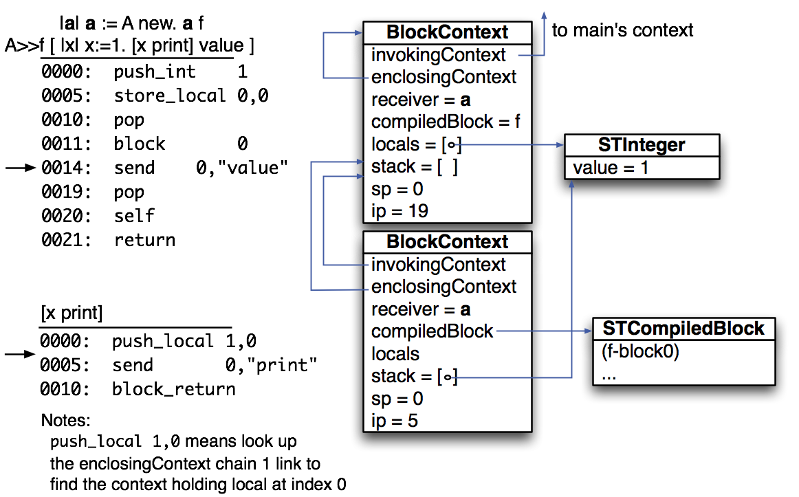

**Tracing block evaluation**. Sometimes it's easier to look at the execution trace. Here is the execution trace of the Smalltalk (`main` method) fragment `^[99] value` without `dbg` instructions:

```
0000:  block    0           MainClass>>main[][main-block0]
0003:  send     0, 'value'  MainClass>>main[][], MainClass>>main-block0[][]
0000:  push_int 99          MainClass>>main[][], MainClass>>main-block0[][99]
0005:  block_return         MainClass>>main[][99]
0008:  return
```

The first instruction pushes a block descriptor, `main-block0`, onto the operand stack of the active context, which is the `main` method of `MainClass`. Sending the `value` message to that descriptor pushes a new active context for the `main-block0` to execute.

You should check out all of the traces that I have inserted as comments into the [TestBlocks.java](https://github.com/USF-CS652-starterkits/parrt-smalltalk/blob/master/test/smalltalk/test/TestBlocks.java) unit tests.

#### Blocks with arguments

Here is what the context stack looks like if the block has an argument right before the message send:

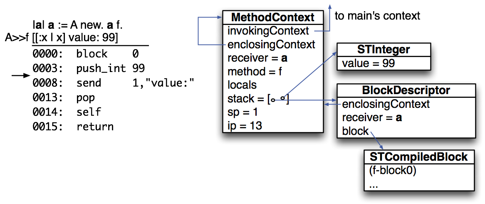

During the message send, while executing the block, the context stack looks like:

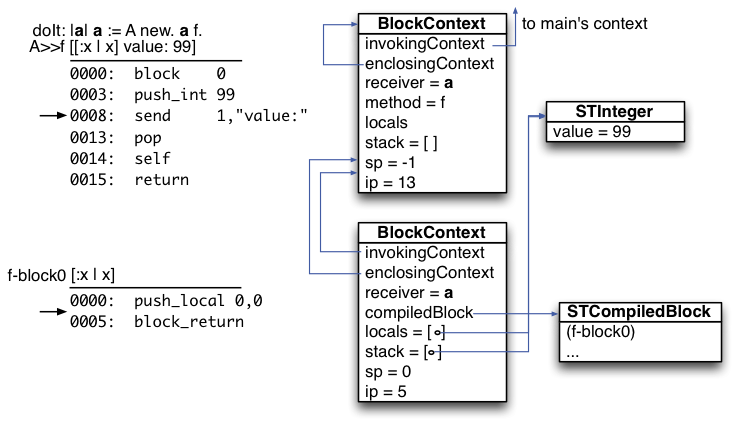

#### When invoking and enclosing contexts differ

And now here is an example that illustrates the critical difference between the `invokingContext` and the `enclosingContext`:

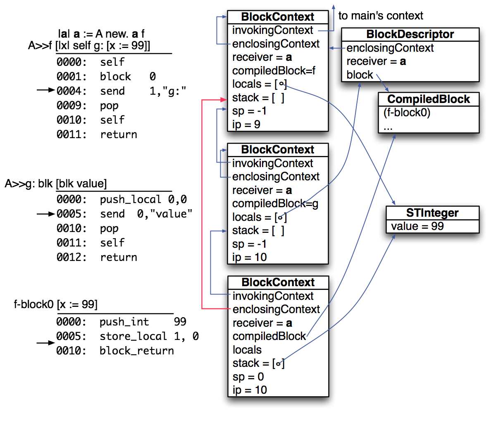

The enclosing context jumps an invoking context because `g` is evaluating the `f-block0`, not `f`.  The enclosing context is used to reference locals. The delta is a statically-determined constant during code generation.

Let's look at some other examples that reference a local outside of its scope, but using the stack notation from the operational semantics so I don't have to draw everything out.

First, here is a similar example using the formal notation that passes a code block from `f` to another method, `g:`, which evaluates the block, `[x:=5]`.  That block alters a local variable of `f`, despite executing "within" `g:`.


Next, we have an unusual example that alters a local variable of a function that has already returned. Method `f` returns a block as a return value that the main program evaluates. The block, `[x:=5]` stores a value into a local variable for `f`, despite the fact that `f` has already returned. The semantics of Smalltalk allow this.

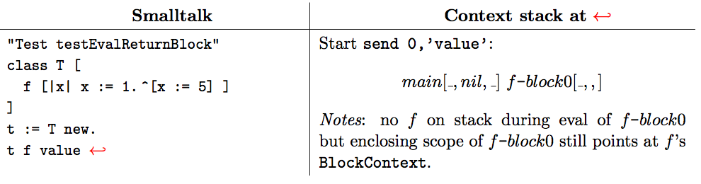

And, finally, here is a complicated example that involves recursion (method `f:pass:` is recursive). The `main` calls `f:pass:`, which passes `f:pass:-block1` to `g:`, which passes it back to `f:pass:`.  Finally, `f:pass:-block2`, `[blk value]`, evaluates the `f:pass:-block1`, `[x:=5]`, block back in the same function, `f:pass:`.

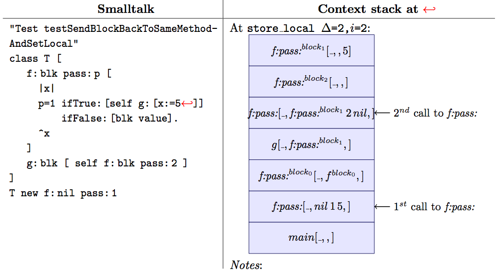

The critical idea is that we have to choose the appropriate `BlockContext` object for `f:pass:` since there are two recursive invocations on the stack. If we were to look up the invoking context chain delta=2 nodes, we would land at the second (recursive) call rather than the first call. Following the enclosing context chain lets us ignore the invocation chain and directs us to the appropriate enclosing context that holds the variable we need.

### Non-local returns

Because blocks can execute method return instructions via `^`*expr* and we can pass blocks to other methods, it's possible to do a so-called nonlocal return. Here's an example that passes block `[^99]` from `f` to `g:`, which evaluates it. By evaluating at block, the VM must return from `f`, despite being inside `g:`.

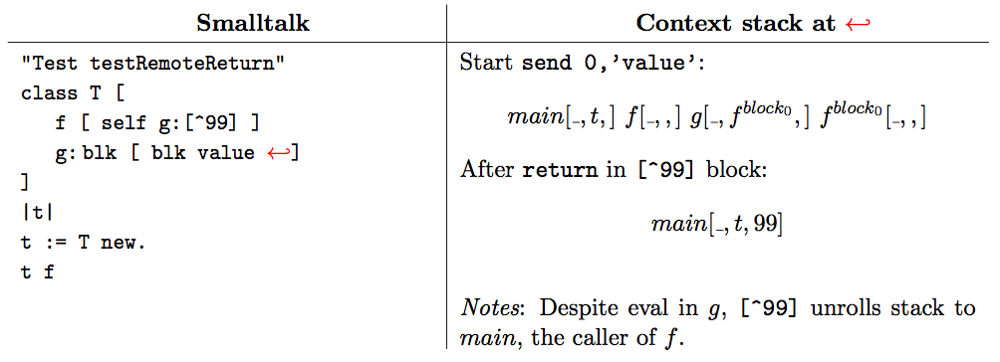

Here is a variation that has `g:` passing the block deeper to `h:`.


Nonlocal returns basically act like exceptions and roll up the stack to the caller (invoking context) of the method surrounding the block with the return instruction.

### Primitive methods

Primitive methods  are like `native` methods in java and SmallTalk code can invoke them like regular methods. Although we have a great deal of our Smalltalk implementation in Smalltalk, to bootstrap we ultimately need to execute some Java. Primitive methods are the interface between Smalltalk and the underlying implementation. For example, in `image.st` you'll see a number of primitive methods:

```
class Integer : Number [
   "this object has no fields visible from smalltalk code and is backed by Java class STInteger"
   + y <primitive:#Integer_ADD>
   - y <primitive:#Integer_SUB>
   * y <primitive:#Integer_MULT>
   / y <primitive:#Integer_DIV>
   < y <primitive:#Integer_LT>
   > y <primitive:#Integer_GT>
   <= y <primitive:#Integer_LE>
   >= y <primitive:#Integer_GE>
   = y <primitive:#Integer_EQ>
   to: n do: blk [
       self <= n ifTrue: [blk value: self. self+1 to: n do: blk]
   ]
   hash [ ^self ]
   mod: n <primitive:#Integer_MOD>
]
```

As we know, there is a `STCompiledBlock` for each Smalltalk-based method, such as `hash`, but there is also one for primitive methods. The difference is that `STCompiledBlock` objects for primitive methods have the following field non-null:

```java
/** A pointer to the primitive implementing the method, if this field
 *  is non-null.
 */
public final Primitive primitive;
```

This field points at an entry in [Primitive.java](https://github.com/USF-CS652-starterkits/parrt-smalltalk/blob/master/src/smalltalk/vm/primitive/Primitive.java). For example, here is the entry for integer add:

```java
Integer_ADD(STInteger::perform)
```

where `Integer_ADD` is an `enum` type with a method pointer field set to `STInteger::perform`. The method pointer is a Java 8 reference to method `perform` in class `STInteger`, although it can point at any static method for our purposes.

To execute a primitive method, the VM should invoke the following method in class `Primitive` with appropriate arguments if it discovers a message to a receiver that implements the method as a primitive.

```java
public STObject perform(BlockContext ctx, int nArgs) {
	return performer.perform(ctx, nArgs, this);
}
```

For example, in response to message `+` sent to an integer receiver, the VM should invoke the equivalent of:

```java
Primitive.Integer_ADD.perform(ctx, 1);
```

I have provided that implementation for you in your starter kit, so let's take a look at another `perform` in the generic [STObject](https://github.com/USF-CS652-starterkits/parrt-smalltalk/blob/master/src/smalltalk/vm/primitive/STObject.java) class. It shows the mechanics of how to implement primitive methods. In particular, it shows how Smalltalk `Object` implements the `asString` primitive method declared as `	Object_ASSTRING(STObject::perform)`.

```java
/** Implement a primitive method in active context ctx.
 *  A non-null return value should be pushed onto operand stack by the VM.
 *  Primitive methods do not bother pushing a `BlockContext` object as
 *  they are executing in Java not Smalltalk.
 */
public static STObject perform(BlockContext ctx, int nArgs, Primitive primitive) {
	VirtualMachine vm = ctx.vm;
	vm.assertNumOperands(nArgs+1); // ensure args + receiver
	int firstArg = ctx.sp - nArgs + 1;
	STObject receiver = ctx.stack[firstArg-1];
	STObject result = vm.nil();
	switch ( primitive ) {
		case Object_ASSTRING:
			ctx.sp--; // pop receiver
			// if not overridden (we got here), ask the *java* backing object for an st string
			result =  receiver.asString();
			break;
		case Object_SAME : // SmallTalk == op. same as == in Java (identity)
			STObject x = receiver;
			STObject y = ctx.stack[firstArg]; // get right operand (first arg)
			ctx.sp -= 2; // throw out receiver and first argument
			result = new STBoolean(x == y); // VM will push this result
			break;
		...
	}
	return result;
}
```

Also take a look at the implementation of the `==` operator, the second case. Its definition in Smalltalk is:

```
== anObject <primitive:#Object_SAME>
```

This implementation illustrates a message/operator that takes an argument (`y`) as well as a receiver. All of the setup code prepares for executing the actual implementation of the equality operator: `result = new STBoolean(x == y)`.

#### Primitive operations

If a primitive method returns a result, the corresponding `perform()` method must return non-null and then the VM will leave it on operand stack of the invoking context (which will be the active context when the primitive finishes). By default, primitive method should return `self`, which is the receiver of the message.

| Smalltalk | Primitive | Description |
|--------|--------|--------|
| `Object error: x` |`Object_Class_ERROR`| Call `vm.error(x.asString().toString())`, which throws an exception |
| `C basicNew` |`Object_Class_BASICNEW`| Create an instance of class `C` and return it |
| `x print` |`Object_PRINT`| `System.out.println(x.asString());`  |
| `x asString` |`Object_ASSTRING`|  Return result of calling Java method `asString` on `x` |
| `x className` |`Object_CLASSNAME`|  Return a string containing the name of `x`'s class |
| `x == y` |`Object_SAME`| Return a new `Boolean` that is true if `x` and `y` point at the same physical object |
| `x hash` |`Object_HASH`| Return a new `Integer` with value `x.hashCode()` |
|\_\_\_\_\_\_\_\_\_\_\_\_\_\_\_\_\_\_\_\_\_|||
| `c asInteger` |`Character_ASINTEGER`|  Return a new integer object with the 16-bit character code of `c` as the value |
| `Character new: i` |`Character_Class_NEW`| Return a new character object with character code (integer) `i` |
|\_\_\_\_\_\_\_\_\_\_\_\_\_\_\_\_\_\_\_\_\_|||
| `x + y` |`Integer_ADD`| Pop right operand `y` and then pop the receiver, `x`, as the left operand; return a new integer with the addition result |
| `x - y` |`Integer_SUB`| ... |
| `x * y` |`Integer_MULT`| ... |
| `x / y` |`Integer_DIV`|  |
| `x mod: y` |`Integer_MOD`|  |
| `x < y` |`Integer_LT`| Pop right operand `y` and then pop the receiver, `x`, as the left operand; return a new `Boolean` with the inequality result |
| `x <= y` |`Integer_LE`| ... |
| `x > y` |`Integer_GT`|  |
| `x >= y` |`Integer_GE`|  |
| `x = y` |`Integer_EQ`|  |
| `x asFloat` |`Integer_ASFLOAT`| Return a new `Float` object with the same value as `x` if `x` is an `Integer`; return the receiver if it's already a `Float` else throw `TypeError` via `vm.error()` |
|\_\_\_\_\_\_\_\_\_\_\_\_\_\_\_\_\_\_\_\_\_|||
| `x + y` |`Float_ADD`| Pop right operand `y` and then pop the receiver, `x`, as the left operand; return a new `Float` with the addition result |
| `x - y` |`Float_SUB`| ... |
| `x * y` |`Float_MULT`| ... |
| `x / y` |`Float_DIV`|  |
| `x < y` |`Float_LT`| Pop right operand `y` and then pop the receiver, `x`, as the left operand; return a new `Boolean` with the inequality result |
| `x <= y` |`Float_LE`| ... |
| `x > y` |`Float_GT`|  |
| `x >= y` |`Float_GE`|  |
| `x = y` |`Float_EQ`|  |
| `x asInteger` |`Float_ASINTEGER`| Return a new `Integer` object with the truncated value of `x` if `x` as a `Float`; return the receiver if it's already an `Integer` else throw `TypeError` via `vm.error()` |
|\_\_\_\_\_\_\_\_\_\_\_\_\_\_\_\_\_\_\_\_\_|||
| `b ifTrue: blk` |`Boolean_IFTRUE`| Pop `blk` as the argument then pop `b` as the receiver. If `b` then evaluate `blk` as if the programmer had said `blk value`|
| `b ifTrue: blk1 ifFalse: blk2` |`Boolean_IFTRUE_IFFALSE`| Pop `blk2` as the 2nd argument, pop `blk1` as the first argument, then pop `b` as the receiver. If `b` then evaluate `blk1` as if the programmer had said `blk1 value` else evaluate `blk2`|
| `b not` |`Boolean_NOT`| Return `true` if `b` is `false` and vice versa.  |
|\_\_\_\_\_\_\_\_\_\_\_\_\_\_\_\_\_\_\_\_\_|||
| `String new: x` |`String_Class_NEW`| Pop `c` as the argument, pop the next value as well, which is the metaclass object for `String`; if `x` is a  string,  return a new string object from `x`; if `x` is a character, returned a new string object with that sole character|
| `s,t` |`String_CAT`| Pop `s`,`t` and return a new string of their concatenated characters  |
| `s=t` |`String_EQ`| Pop `s`,`t` and return a `Boolean` indicating whether or not the two strings have the same character sequence |
| `s asArray` |`String_ASARRAY`| Return the characters of `s` as an `Array` object filled with `Character` objects. |
|\_\_\_\_\_\_\_\_\_\_\_\_\_\_\_\_\_\_\_\_\_|||
| `x value` |`BlockDescriptor_VALUE`| Pop `x` as the receiver. Create and push a new active `BlockContext` derived from `BlockDescriptor` `x`; there is no result from this primitive--it just pushes a new context |
| `x value: y` |`BlockDescriptor_VALUE_1_ARG`| Create and push a new active `BlockContext` derived from `BlockDescriptor` `x`; copy argument `y` to the operand stack of the new context|
| `x value: y value: z` |`BlockDescriptor_VALUE_2_ARGS`| Create and push a new active `BlockContext` derived from `BlockDescriptor` `x`; copy arguments `y` and `z` to the operand stack of the new context |
|\_\_\_\_\_\_\_\_\_\_\_\_\_\_\_\_\_\_\_\_\_|||
| `Array new: n` |`Array_Class_NEW`| Return a new instance of `Array` with `n` elements initialized to `nil`  |
| `a size` |`Array_SIZE`|  Return an `Integer` with the number of elements of `a`|
| `a at: i` |`Array_AT`| Return the element at position `i` of `a`, counting from 1 not 0 like C-derived languages |
| `a at: i put: v` |`Array_AT_PUT`| Store `v` in the `i`th position of `a` |
|\_\_\_\_\_\_\_\_\_\_\_\_\_\_\_\_\_\_\_\_\_|||
| `Transcript show: x` |`TranscriptStream_SHOW`| Same as `x print` |

### Class methods

Smalltalk has class methods just like Java does and we use the `class` keyword on methods in our Smalltalk to indicate which methods are class methods. As with regular methods, class methods can also have primitive implementations:
 
```
class Object [
    class basicNew <primitive:#Object_Class_BASICNEW>
    class new [ ^self basicNew initialize ]
    initialize ["do nothing by default" ^self]
	...
]
```

Class methods are treated no differently than instance methods except that we turn on `isClassMethod` in `STMethod` and then `STCompiledBlock`.  Class methods only work on Smalltalk `Class` (Java `STMetaClassInfo`) objects but we rely on the programmer to avoid sending class messages to instances (see [testClassMessageOnInstanceError](https://github.com/USF-CS652-starterkits/parrt-smalltalk/blob/master/test/smalltalk/test/TestCore.java#L1022)) and vice versa (see [testInstanceMessageOnClassError](https://github.com/USF-CS652-starterkits/parrt-smalltalk/blob/master/test/smalltalk/test/TestCore.java#L1059)). For example, `Array new` makes sense because `new` is a class method but `x new` for some instance `x` does not. Similarly, `names size` makes sense but `Array size` does not.

Class methods are implemented by the VM just like instance methods. Class methods with primitive implementations also route to a `perform` method just as they do for instance methods for it for example, here is the skeleton structure for answering class methods of `Object`:

```java
public static STObject perform(BlockContext ctx, int nArgs, Primitive primitive) {
		VirtualMachine vm = ctx.vm;
		ctx.vm.assertNumOperands(nArgs+1); // ensure args + receiver
		int firstArg = ctx.sp - nArgs + 1;
		STObject receiver = null;
		STObject result = vm.nil();
		if ( firstArg-1 >= 0 ) receiver = ctx.stack[firstArg-1];
		switch ( primitive ) {
				case Object_Class_BASICNEW:
						break;
				case Object_Class_ERROR:
						vm.error(ctx.stack[firstArg].asString().toString());
						break;
		}
		return result;
}
```

Please note that `self` in a class method refers to the class definition object and not an instance of the class.

## Bytecode Operational Semantics

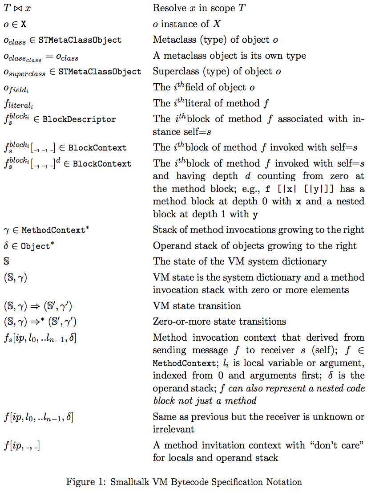

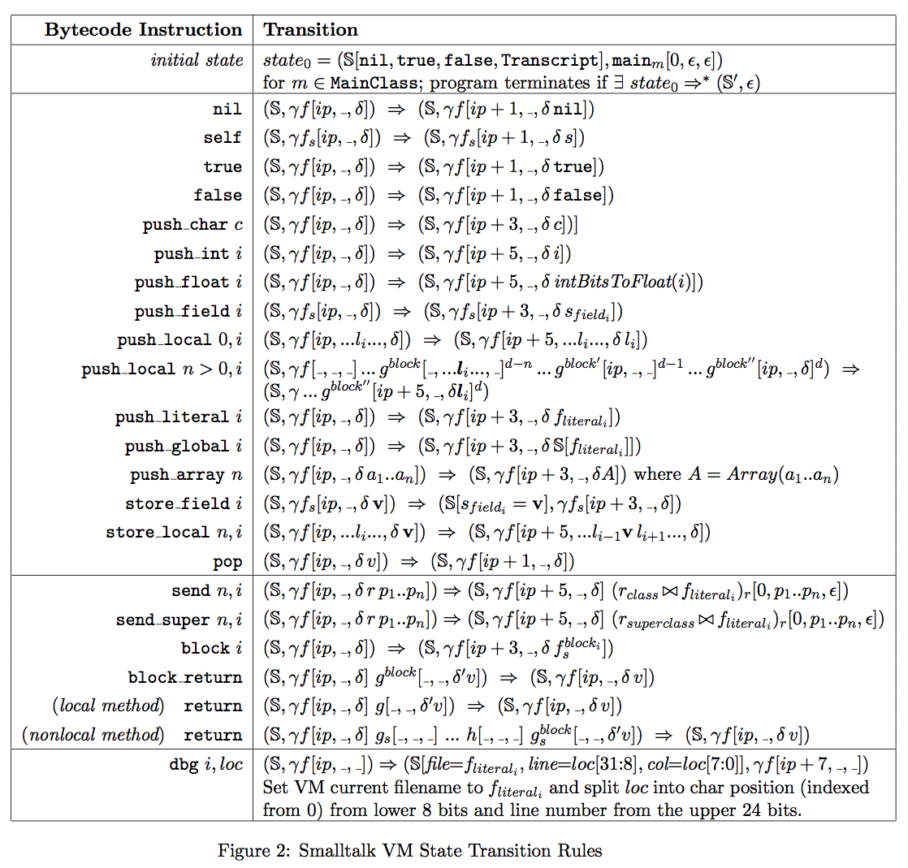

## Compilation

[Compiler starter kit](https://github.com/USF-CS652-starterkits/parrt-smalltalk/blob/master/src/smalltalk/compiler).

For the constructs as shown below in the compilation rules, use visitor methods to compute the `Code` result for particular construct. As a side effect, you will be tracking literals within each block/method. Further, you will be setting the `compiledBlock` field of each block/method. In a sense, the result of compilation is the decorated scope tree and is represented by the collection of `compiledBlock`s.  But, for clarity, the result of compilation is a list of `STMetaClassObject` objects, one for each class defined in the a symbol table. These will be installed in the `SystemDictionary` of a VM prior to execution:


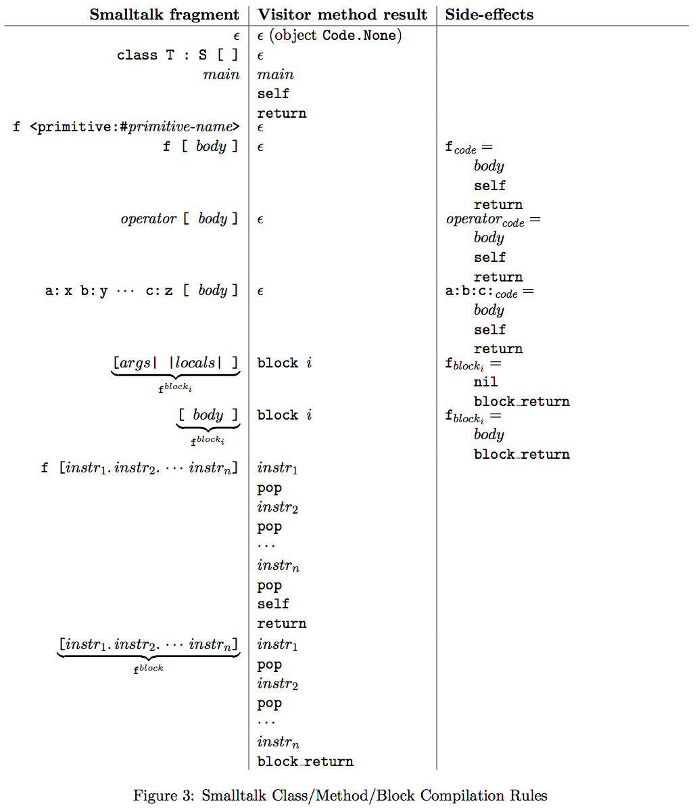

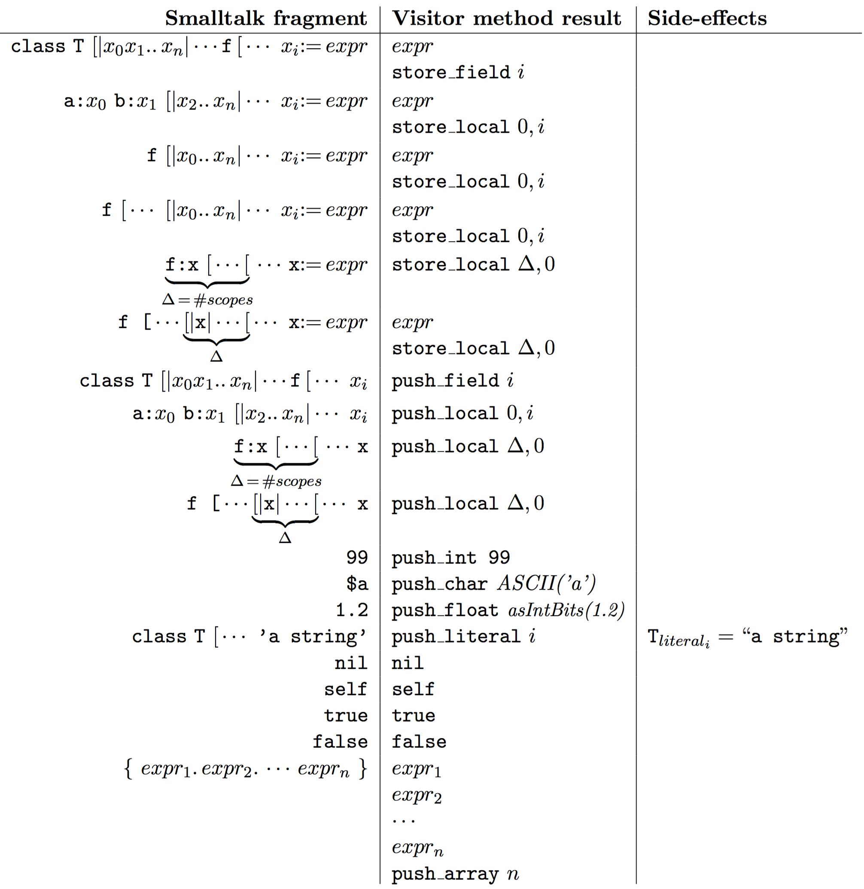

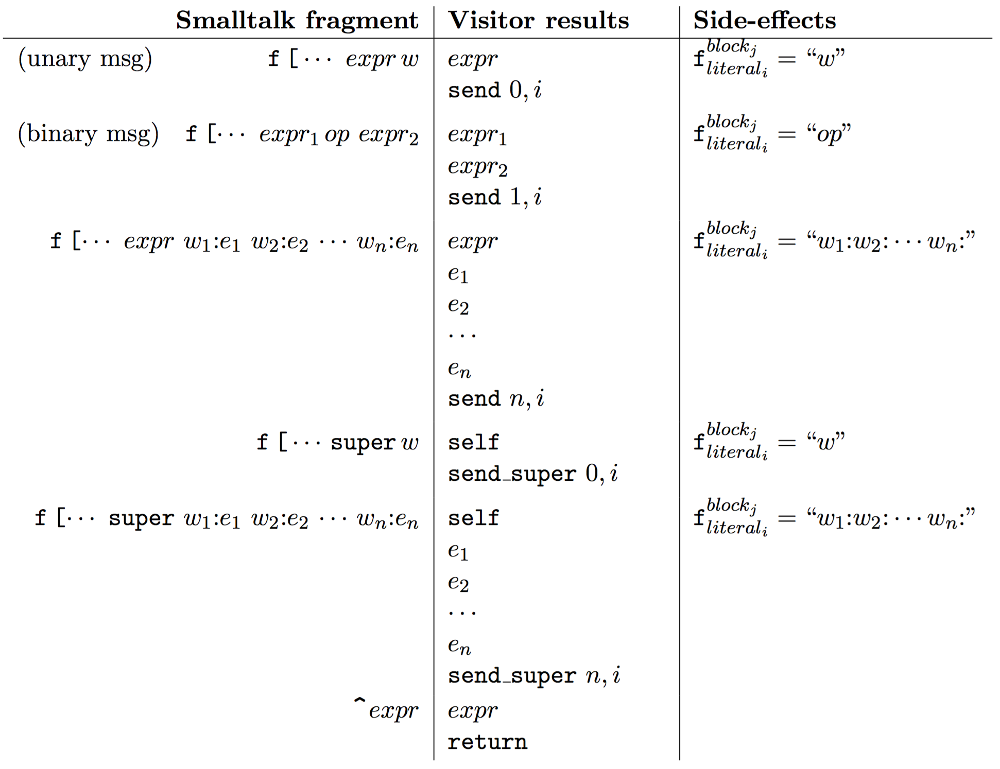

### DBG instructions

The DBG instructions informed the VM where in the original Smalltalk source code the following bytecode instruction(s) comes from. The debug information is extremely useful when writing Smalltalk code, although it can be useful when debugging the VM itself. You need to insert DBG instructions in the following locations:

1. `visitMain`. At the end of the body, before pop, self, return.
2. `visitSmalltalkMethodBlock`.  After visiting the children, before the pop, self, ...
3. `visitAssign`

		//At the end
		if (compiler.genDbg) {
		    code = dbg(ctx.start).join(code);
		}
		//before return
4. `visitKeywordSend`

		//After getLiteralIndex()
		if(compiler.genDbg){
		    code = Code.join(code, dbg(ctx.KEYWORD(0).getSymbol()));
		}
		//Before you join code for Send
5. `visitBinaryExpression`

		//After you join code for visitUnaryExpression(1)
		if(compiler.genDbg){
		    code = Code.join(dbg(ctx.bop(i-1).getStart()), code);
		}
		//Before you join code for Send
6. `visitBlock`.

		//After you join code for visitChildren()
		if(compiler.genDbg){
		    code = Code.join(code, dbgAtEndBlock(ctx.stop));
		}
		//Before you join push_block_return
7. `visitEmptyBody`

		//At the end
		if(compiler.genDbg){
		    code = Code.join(code, dbgAtEndBlock(ctx.stop));
		}
		//Before you return
8. `visitReturn`

		//After visitChildren
		if (compiler.genDbg) {
		    e = Code.join(e, dbg(ctx.start)); // put dbg after expression as that is when it executes
		}
		//Before you join code for method_return()
9. `visitUnaryMsgSend`

		//At the end
		if (compiler.genDbg) {
		    code = Code.join(dbg(ctx.ID().getSymbol()), code);
		}
		//Before return

## Tasks

Most of the compiler is given to you, but you need to build the `CodeGenerator` parse tree **visitor**. This is the meat of the compiler.  Then, build the VM by filling in all of the primitive method operations (static `perform` methods) and key classes like `SystemDictionary`, `VirtualMachine`, `BlockContext`, ...
