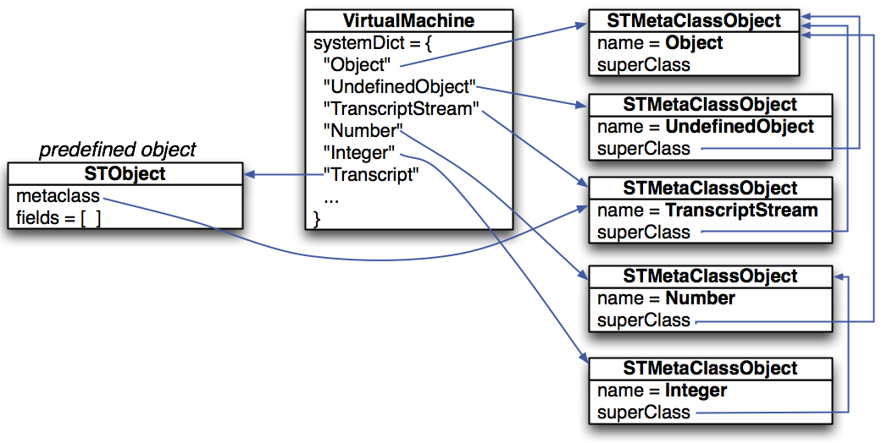
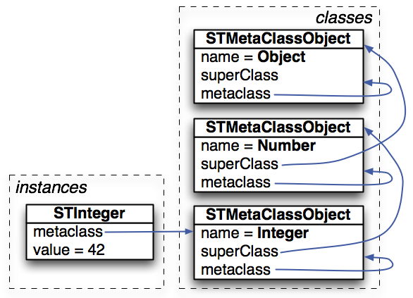
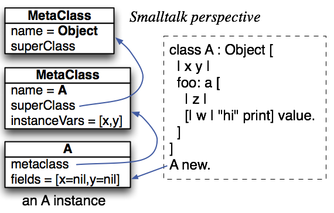
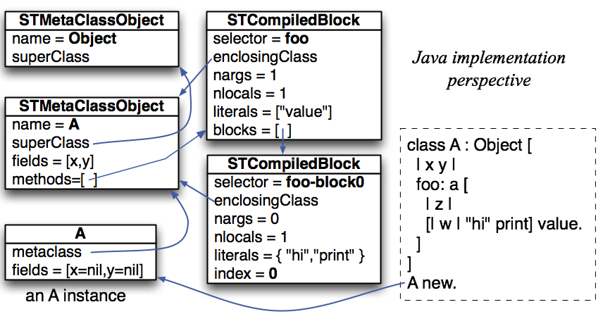

# Smalltalk (*subset*) Compiler and Interpreter

## Goal

This project is to build a full compiler and interpreter / virtual machine (VM) for a subset of Smalltalk.


## Smalltalk language definition

Here is the [formal ANTLR grammar](https://github.com/USF-CS652-starterkits/parrt-smalltalk/blob/master/src/smalltalk/compiler/Smalltalk.g4).

no class variables but allows class methods
we disallow globals. x:=expr will generate code for expr but not the store if x is not a valid argument, local variable, or field. no ';' extended msg send notation, no `#(1 2 3)` array literal notation, but with dynamic array notation `{1. 2. 3}`. Much of the implementation is not exposed to the programmer, such as method invocation contexts.

Paraphrasing the [Pharo cheat sheet](http://files.pharo.org/media/flyer-cheat-sheet.pdf):

### Literals and keywords
| Syntax | Semantics |
|--------:|--------|
|  `nil` | undefined object |
|`true,false`|boolean liberals|
|`self`|receiver of current message (method call)|
|`super`|receiver of current message but with superclass scope|
|`class`|start of a class definition or class method|
|`"..."`|comment (allowed anywhere)|
|`'abc'`|string literal|
|`$a`|character literal `a`|
|`123`|integer literal|
|`1.23`|floating-point literal (single precision), no scientific notation|

### Expression syntax

| Syntax | Semantics |
|---------:|--------|
|`.`|expression separator (not terminator)|
|`x := *expr*`|assignment to local or field (there are no global variables)|
|`^`*expr*|return expression from method, even when nested in a `[...]`block|
|`|x y|`|define two local variables or fields|
|`{a. 1+2. aList size}`|dynamic array constructed from three expressions separated by periods|
|`[:x | 2*x]`|code block taking one parameter and evaluating to twice that parameter; in common usage, of these are called lambdas or closures.|
|`[:x :y | x*y]`|code block taking two parameters|
|`[99] value` |use `value` method to evaluate a block with 99|
|`[:x | 2*x] value: 10` |use `value:` method to evaluate a block with parameter 10|

### Message send expressions

Smalltalk uses the concept of message sending, which is really the same thing as method calling in Java. There are three kinds of messages:

1. **Unary messages**.  These are messages with no arguments. For example, Smalltalk `myList size` is just `myList.size()` in Java. The most common unary message is probably `new`, which creates a new object. For example, `Array new`, which is more or less `new Array()` in Java.
1. **Binary operator messages**.  These messages take one argument and take the form of one or more special symbols. For example, `1+2` is the usual addition and `x->y` creates an association object used by `Dictionary`.
```java
/** "A binary message selector is composed of one or
     two nonalphanumeric characters. The only restriction is
     that the second character cannot be a minus sign."
     BlueBlook p49 in pdf.
 */
bop : (opchar|'-') opchar? ;
opchar
	:	'+'
	|	'/' | '\\'
	|	'*' | '~'
	|	'<' | '>'
	|	'=' | '@' | '%' | '|' | '&' | '?' | ','
	;
```
3. **Keyword messages**. These messages take one or more arguments, but unlike Java, the argument names are used in the call. For example, here's how to execute code block over the values from 1 to 5: `1 to: 5 do: [:i | ...]`.  Method `to:do:` passes the iteration number as an argument to the code block when it evaluates it. Here's how to take the conjunction of two booleans: `true and: false`.

**Precedence**.  Unary operators have higher precedence than binary operators, which have higher precedence than keyword operators.  Operators within the same type (unary, binary, keyword) group left to right. That means that `1+2*3` is `(1+2)*3` not `1+(2*3)` as we use in arithmetic and most other programming languages. Parentheses override the default precedence as usual. Here's an example that uses all three operators:

```
1+2 to: myList size do: [:i | ...]
```

The keyword message `to:do:` has lowest precedence and so `myList size` is evaluated and passed as the `to:` parameter.  Similarly, `1+2` evaluates to 3 and is the receiver of the `to:do:` message. When it's unclear to the reader what the president says, use parentheses.

### Class, method syntax

Smalltalk has no file format or syntax for class definitions because it was all done in a code browser. In our case, we need a file format and some very simple syntax will suffice. The following class definition for `Array` demonstrates all bits of the syntax:

```
class Array : Collection [
   "An object that represents a Smalltalk array of objects backed by Java class STArray"
   class new [ ^self new: 10 ]
   class new: size <primitive:#Array_Class_NEW>

   size <primitive:#Array_SIZE>
   at: i <primitive:#Array_AT>
   at: i put: v <primitive:#Array_AT_PUT>
   do: blk [
       1 to: self size do: [:i | blk value: (self at: i)].
   ]
]
```

Classes are defined using the `class` keyword followed by the name of the class. If there is a superclass, use a colon followed by the superclass name (`Collection`, in this case). The body of the class is wrapped in square brackets.

Class methods are proceeded with the `class` keyword but are otherwise the same as other methods. Both of the `new` methods are class methods and the second one, `new:` is a primitive that has no Smalltalk implementation. Instead, the VM will look for a `Primitive` called `Array_Class_NEW` and execute the associated `perform` method. The non-primitive class method `new` invokes the primitive `new:` with a parameter of 10.

Method `size` takes no parameters and is primitive. Method `at:` takes one parameter and is primitive.  Method `at:put:` takes two parameters and is primitive.  Method `do:` takes one parameter, a code block, and has a Smalltalk implementation.

## Virtual machine

[VM starter kit](https://github.com/USF-CS652-starterkits/parrt-smalltalk/blob/master/src/smalltalk/vm).

### Operational semantics


### Representing objects

```java
public class VirtualMachine {
	/** The dictionary of global objects including class meta objects */
	public final SystemDictionary systemDict; // singleton

	/** "This is the active context itself. It is either a MethodContext
	 *  or a BlockContext." BlueBook p 605 in pdf.
	 */
	public MethodContext ctx;
```

The initial SystemDictionary looks like this:



And here is how an instance of an integer is represented using a *backing class* called `STInteger`. Note that `STMetaClassObject` is also an object and so has a `metaclass` pointer, but it always points at itself.



Here is how an instance (of `A`) is represented from Smalltalk perspective:



and then from the implementation point of view. Here `A` does not have a backing class for implementation.



## Representing bytecode

In [Bytecode.java](https://github.com/USF-CS652-starterkits/parrt-smalltalk/blob/master/src/smalltalk/vm/Bytecode.java), you will see the definitions of the various bytecodes. Each instruction above gets its own unique integer "op code". There is also a definition of how many operands and the operand sizes so that we can disassemble code. For example, here is a class with a simple method:

```
class T [
	|x|
	foo [|y| x := y.]
]
```

and the bytecode generated for method `foo`:
```
0000:  push_local     0, 0
0005:  store_field    0
0008:  self             
0009:  return           
```

The numbers on the left are the byte addresses of the instructions. The first instruction takes five bytes because there is one byte for the [`push_local`](https://github.com/USF-CS652-starterkits/parrt-smalltalk/blob/master/src/smalltalk/vm/Bytecode.java#L66) instruction and [two operands](https://github.com/USF-CS652-starterkits/parrt-smalltalk/blob/master/src/smalltalk/vm/Bytecode.java#L96) that are each two bytes long.

### Method contexts

The most challenging part of the Smalltalk VM is properly handling message sends and block evaluation.  It all comes down to `BlockContext` objects. Let's take a look at a sequence of images that depict the context stack as it changes during the execution of a simple method, `f`, that returns the addition of two numbers.
Here's what the active context looks like after the two integers have been pushed onto the stack:


Then, during the execution of the message send, `+`, the context stack looks like the following (assuming `+` is not primitive for the sake of this demonstration):


The new `BlockContext` has its own instruction pointer and stack for operands. After the `+` message send finishes, its return value will be on the operand stack of the invoking context, which is `f` in this case:


### Block contexts

Now let's turn to a sample block evaluation.  To evaluate a block, the `BLOCK` bytecode pushes a `BlockDescriptor` object as a kind of prototype for the context we want to create.


The `value` message effectively converts a block descriptor into a block context and pushes it as the active context. That means that the next iteration of the fetch-decode-execute cycle will start executing the block's bytecode. Here is what the context stack looks like during the execution of the `value` message and after the first instruction of the block (`push_local`):


#### Blocks with arguments

Here is what the context stack looks like if the block has an argument right before the message send:


During the message send, while executing the block, the context stack looks like:


#### When invoking and enclosing contexts differ

And now here is an example that illustrates the critical difference between the `invokingContext` and the `enclosingContext`:


The enclosing context jumps an invoking context because `g` is evaluating the `f-block0`, not `f`.

Let's look at some other examples that reference a local outside of its scope, but using the stack notation from the operational semantics so I don't have to draw everything out.

First, here is an example that passes a code block from `f` to another method, `g:`, which evaluates the block, `[x:=5]`.  That block alters a local variable of `f`, despite executing "within" `g:`.


Next, we have an unusual example that alters a local variable of a function that has already returned. Method `f` returns a block as a return value that the main program evaluates. The block, `[x:=5]` stores of value into a local variable for `f`, despite the fact that `f` has already returned. The semantics of Smalltalk allow this.


And, finally, here is a complicated example that involves recursion (method `f:pass:` is recursive). The `main` calls `f:pass:`, which passes `f:pass:-block1` to `g:`, which passes it back to `f:pass:`.  Finally, `f:pass:-block2`, `[blk value]`, evaluates the `f:pass:-block1`, `[x:=5]`, block back in the same function, `f:pass:`.


The critical idea is that we have to choose the appropriate `BlockContext` object for `f:pass:` since there are two recursive invocations on the stack. If we were to look up the invoking context chain delta=2 nodes, we would land at the second (recursive) call rather than the first call. Following the enclosing context chain lets us ignore the invocation chain and directs us to the appropriate enclosing context that holds the variable we need.

### Non-local returns

Because blocks can execute method return instructions via `^`*expr* and we can pass blocks to other methods, it's possible to do a so-called nonlocal return. Here's an example that passes block `[^99]` from `f` to `g:`, which evaluates it. By evaluating at block, the VM must return from `f`, despite being inside `g:`.


Here is a variation that has `g:` passing the block deeper to `h:`.


Nonlocal returns basically act like exceptions and roll up the stack to the caller (invoking context) of the method surrounding the block with the return instruction.

## Compilation

[Compiler starter kit](https://github.com/USF-CS652-starterkits/parrt-smalltalk/blob/master/src/smalltalk/compiler).

For the constructs as shown below in the compilation rules, use visitor methods to compute the `Code` result for particular construct. As a side effect, you will be tracking literals within each block/method. Further, you will be setting the `compiledBlock` field of each block/method. In a sense, the result of compilation is the decorated scope tree and is represented by the collection of `compiledBlock`s.  The constructor for `STMetaClassObject` collects all of compiled code for the methods of that class.  Also see `SystemDictionary`:
```java
	/** Convert the symbol table with classes, methods, and compiled code
	 *  (as computed by the compiler) into a system dictionary that has
	 *  meta-objects.
	 *
	 *  This method assumes that the compiler has annotated the symbol table
	 *  symbols such as {@link STBlock} with pointers to the
	 *  {@link smalltalk.vm.primitive.STCompiledBlock}s.
	 */
	public void symtabToSystemDictionary(STSymbolTable symtab) {
```


## Tasks

* Build `DefineSymbols` parse tree listener. This creates a scope tree per our normal procedure.
* Build `ResolveSymbols` parse tree listener. This walks the parse tree again to verify that identifiers on the left-hand side of assignments are locals or fields. It also sets the `sym` field of any identifier node by resolving the associated identifier in the current scope.
* Build `CodeGenerator` parse tree **visitor**. This is the meat of the compiler. 
* Build VM by filling in all of the primitive method operations (static `perform` methods) and key classes like `SystemDictionary` and `VirtualMachine`.
